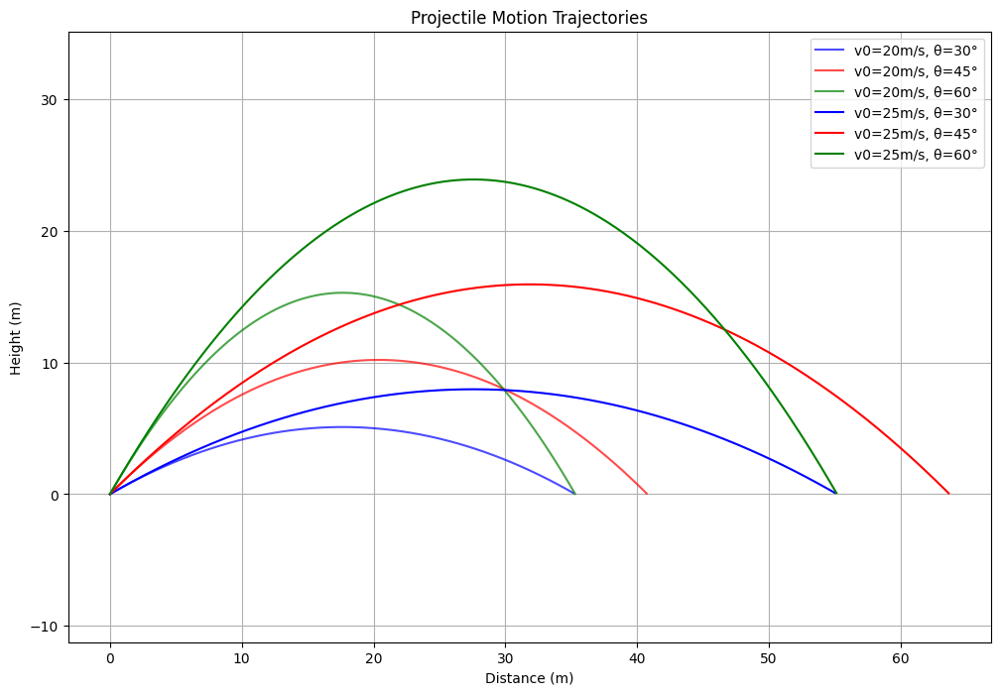

# Problem 1
# Investigating the Range as a Function of the Angle of Projection

## 1. Theoretical Background

# **Theoretical Foundation of Projectile Motion**

## **1. Introduction**
Projectile motion is a fundamental topic in classical mechanics that describes the motion of an object under the influence of gravity. This motion can be analyzed by breaking it into two independent components: **horizontal motion** (constant velocity) and **vertical motion** (uniformly accelerated motion). The governing equations of motion can be derived using Newton’s laws.

---

## **2. Derivation of Governing Equations**
To analyze projectile motion, we consider an object launched with an **initial velocity** $v_0$ at an **angle of projection** $\theta$ from the horizontal. The motion is influenced by gravitational acceleration $g$, assuming air resistance is negligible.

### **2.1 Equations of Motion**
Using kinematic equations, we resolve the motion into **horizontal** and **vertical** components:

1. **Horizontal displacement** $x(t)$:

   $$x=v_0\cos\theta\cdot t$$

2. **Vertical displacement** $y(t)$:

   $$y=v_0\sin\theta\cdot t-\frac{1}{2}gt^2$$

3. **Horizontal velocity** $v_x(t)$:

   $$v_x=v_0\cos\theta$$

   (Since there is no acceleration in the horizontal direction, the velocity remains constant.)

4. **Vertical velocity** $v_y(t)$:

   $$v_y=v_0\sin\theta-gt$$

5. **Time of flight** (when the projectile returns to the initial height $y=0$):

   $$t_f=\frac{2v_0\sin\theta}{g}$$

6. **Maximum height** (when vertical velocity becomes zero, $v_y=0$):

   $$H=\frac{(v_0\sin\theta)^2}{2g}$$

7. **Horizontal range** (total horizontal distance traveled):

   $$R=\frac{v_0^2\sin(2\theta)}{g}$$

---

## **3. Effect of Initial Conditions**
### **3.1 Influence of Launch Angle $\theta$**
- The **horizontal range** is maximized when $\theta=45^\circ$, as $\sin(2\theta)$ reaches its maximum at this angle.
- At lower angles, the projectile travels farther horizontally but remains in the air for a shorter duration.
- At higher angles, the projectile reaches greater heights but covers less horizontal distance.

### **3.2 Influence of Initial Velocity $v_0$**
- A greater initial velocity increases **both the range and the maximum height**.
- The relationship between range and initial velocity is quadratic: $R\propto v_0^2$.

### **3.3 Influence of Gravitational Acceleration $g$**
- Higher values of $g$ (such as on planets with stronger gravity) reduce both the **maximum height** and **horizontal range**.
- The time of flight is inversely proportional to $g$, meaning weaker gravity results in longer projectile motion.

---

## **4. Conclusion**
The theoretical foundation of projectile motion is based on Newtonian mechanics and kinematic equations. The motion is characterized by:
- **Independent horizontal and vertical components**.
- **A parabolic trajectory** due to constant gravitational acceleration.
- **A well-defined maximum range at 45° launch angle**.

In the next sections, we will analyze how these theoretical principles apply in practical scenarios and computational simulations.

### Phython Implimentation
```python
import numpy as np
import matplotlib.pyplot as plt

class ProjectileMotion:
    def __init__(self, g=9.81):
        """Initialize with gravitational acceleration (m/s²)"""
        self.g = g

    def calculate_trajectory(self, v0, angle_deg, t_step=0.01):
        """
        Calculate projectile trajectory
        Parameters:
            v0: initial velocity (m/s)
            angle_deg: launch angle in degrees
            t_step: time step for calculations
        Returns:
            x, y: arrays of x and y coordinates
        """
        # Convert angle to radians
        angle_rad = np.radians(angle_deg)
        
        # Initial velocity components
        vx = v0 * np.cos(angle_rad)
        vy = v0 * np.sin(angle_rad)
        
        # Time of flight
        t_flight = 2 * vy / self.g
        
        # Generate time points
        t = np.arange(0, t_flight + t_step, t_step)
        
        # Calculate positions
        x = vx * t
        y = vy * t - 0.5 * self.g * t**2
        
        # Filter out negative y values (after hitting ground)
        valid_indices = y >= 0
        return x[valid_indices], y[valid_indices]

    def get_range(self, v0, angle_deg):
        """Calculate maximum range for given velocity and angle"""
        angle_rad = np.radians(angle_deg)
        return (v0**2 * np.sin(2 * angle_rad)) / self.g

def plot_trajectory_comparison():
    """Plot trajectories for different angles and velocities"""
    projectile = ProjectileMotion()
    
    # Parameters to compare
    velocities = [20, 25]  # m/s
    angles = [30, 45, 60]  # degrees
    colors = ['blue', 'red', 'green']
    
    plt.figure(figsize=(12, 8))
    
    # Plot trajectories
    for v0 in velocities:
        for angle, color in zip(angles, colors):
            x, y = projectile.calculate_trajectory(v0, angle)
            plt.plot(x, y, label=f'v0={v0}m/s, θ={angle}°', color=color, alpha=0.7 if v0 == 20 else 1)
    
    plt.title('Projectile Motion Trajectories')
    plt.xlabel('Distance (m)')
    plt.ylabel('Height (m)')
    plt.grid(True)
    plt.legend()
    plt.axis('equal')
    plt.show()

def plot_range_vs_angle():
    """Plot range vs launch angle"""
    projectile = ProjectileMotion()
    v0 = 20  # constant velocity of 20 m/s
    
    # Generate angles from 0 to 90 degrees
    angles = np.arange(0, 91, 1)
    ranges = [projectile.get_range(v0, angle) for angle in angles]
    
    plt.figure(figsize=(10, 6))
    plt.plot(angles, ranges, 'b-')
    plt.title(f'Range vs Launch Angle (v0 = {v0} m/s)')
    plt.xlabel('Launch Angle (degrees)')
    plt.ylabel('Range (m)')
    plt.grid(True)
    
    # Mark maximum range (should be at 45°)
    max_range = max(ranges)
    max_angle = angles[ranges.index(max_range)]
    plt.plot(max_angle, max_range, 'ro', label=f'Max range = {max_range:.1f}m at {max_angle}°')
    plt.legend()
    plt.show()

def main():
    """Main function to run simulations"""
    projectile = ProjectileMotion()
    
    # Example scenario
    v0 = 20  # m/s
    angle = 45  # degrees
    
    # Calculate and print single trajectory info
    x, y = projectile.calculate_trajectory(v0, angle)
    max_range = projectile.get_range(v0, angle)
    print(f"Initial velocity: {v0} m/s")
    print(f"Launch angle: {angle}°")
    print(f"Maximum range: {max_range:.2f} m")
    print(f"Maximum height: {max(y):.2f} m")
    
    # Generate comparison plots
    plot_trajectory_comparison()
    plot_range_vs_angle()

if __name__ == "__main__":
    main()
```

## Plot

