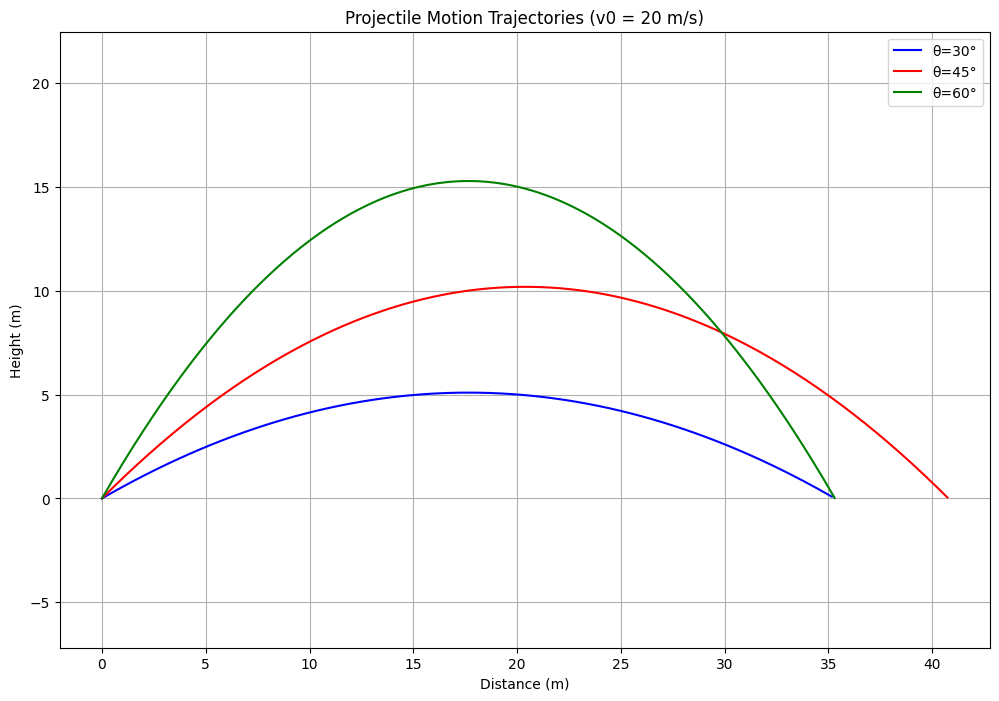

# Problem 1
# Investigating the Range as a Function of the Angle of Projection


## **1. Introduction**
Have you ever wondered how a soccer ball follows a curved path when kicked? Or how rockets and missiles follow precise trajectories? This is all because of **projectile motion**!  

In this report, i will **explore how the range of a projectile depends on the launch angle** and break it down step by step.

---

## **2. What is Projectile Motion?**
Projectile motion happens when an object is launched into the air and moves under the influence of **gravity**. The motion can be split into two parts:

- **Horizontal motion**: The object moves forward with a constant speed.

- **Vertical motion**: The object moves up and down due to gravity.

To understand projectile motion better, let's derive some important equations.

---

## **3. Key Equations of Motion** 

### **3.1 Breaking Motion into Components**
If an object is launched with an **initial speed** $v_0$ at an **angle** $\theta$, we can break this velocity into:

- **Horizontal velocity**: $v_x=v_0\cos\theta$

- **Vertical velocity**: $v_y=v_0\sin\theta$

Since gravity **only affects vertical motion**, the horizontal velocity **stays constant**.

---

### **3.2 Equations for Position and Velocity**
Using basic physics formulas, we get:

1️⃣ **Horizontal position (distance traveled in time $t$)**:

$$x=v_0\cos\theta\cdot t$$

2️⃣ **Vertical position (height at time $t$)**: 

$$y=v_0\sin\theta\cdot t-\frac{1}{2}gt^2$$

3️⃣ **Velocity in the horizontal direction** (always constant):  

$$v_x=v_0\cos\theta$$

4️⃣ **Velocity in the vertical direction** (changes due to gravity): 

$$v_y=v_0\sin\theta-gt$$

---

### **3.3 Finding Special Points**
Now let's look at some important moments in the projectile’s motion.

✔️ **Time of Flight** (How long the object stays in the air): 

$$t_f=\frac{2v_0\sin\theta}{g}$$  

✔️ **Maximum Height** (The highest point the object reaches): 

$$H=\frac{(v_0\sin\theta)^2}{2g}$$  

✔️ **Range (Total Distance the Object Travels Before Hitting the Ground)**:

$$R=\frac{v_0^2\sin(2\theta)}{g}$$  

 **Interesting Fact:** The projectile travels the **longest distance** when launched at **45°** because $\sin(2\theta)$ is **largest at this angle**.

---

## **4. Family of Solutions**
The equations above describe a **family of solutions** depending on different values of:

1. **Launch speed ($v_0$)**: Faster projectiles travel farther and higher.

2. **Launch angle ($\theta$)**: Determines the shape of the trajectory.

3. **Gravity ($g$)**: Affects how quickly the projectile falls.

4. **Initial height ($h$)**: Changes the total flight time and range.

By adjusting these values, we get **different possible trajectories**, from low and fast motions (like bullets) to high and slow ones (like thrown balls).

---

## **5. Limitations of the Idealized Model**
The equations we used assume an **ideal world** where:

❌ **No air resistance**: In reality, air slows down projectiles.  
❌ **Flat ground assumption**: The model assumes the projectile lands at the same height.  
❌ **Constant gravity ($g$)**: Gravity actually changes with altitude.  

Because of these assumptions, our equations give **approximate results** in the real world.

---

## **6. Extending the Model: Real-World Effects**
To make the model more **realistic**, we can add:

✅ **Air Resistance (Drag Force)**  

   - The force slows the projectile down.  
   - The drag force is proportional to the square of the velocity:  

     $$F_d=\frac{1}{2} C_d \rho A v^2$$  

     where $C_d$ is the drag coefficient, $\rho$ is air density, and $A$ is the cross-sectional area.  

✅ **Wind Effects**  

   - A tailwind increases range, while a headwind decreases it.  

✅ **Launch Altitude**  

   - At high altitudes, air resistance is lower, and gravity is weaker, so objects travel **farther**.  

✅ **Rotation of the Earth (Coriolis Effect)** 

   - Important for long-range artillery and missiles.  

---

## **7. Real-World Applications 🌍**
Projectile motion is not just for physics classes! It applies to:

- **Sports**: How football players kick the ball at different angles.

- **Military**: How missiles and bullets are fired for maximum range.

- **Space Exploration**: How rockets are launched at precise angles.

---


# Phython Implimentation

```python
def plot_trajectory_comparison_separate():
    """Plot trajectories for different angles and velocities on separate plots"""
    projectile = ProjectileMotion()
    
    # Parameters to compare
    velocities = [20, 25]  # m/s
    angles = [30, 45, 60]  # degrees
    colors = ['blue', 'red', 'green']
    
    for v0 in velocities:
        plt.figure(figsize=(12, 8))  # Create a new figure for each velocity
        
        # Plot trajectories for the current velocity
        for angle, color in zip(angles, colors):
            x, y = projectile.calculate_trajectory(v0, angle)
            plt.plot(x, y, label=f'θ={angle}°', color=color)
        
        plt.title(f'Projectile Motion Trajectories (v0 = {v0} m/s)')
        plt.xlabel('Distance (m)')
        plt.ylabel('Height (m)')
        plt.grid(True)
        plt.legend()
        plt.axis('equal')
        plt.show()  # Show the plot for the current velocity before moving to the next

# Call the modified function to generate the plots
plot_trajectory_comparison_separate()
```

## Plot




---

## **8. Conclusion**
Now we u understand the key ideas behind projectile motion:

- **It has both horizontal and vertical movement**.

- **Gravity only affects the vertical motion**.

- **The best angle for the longest range is 45°**.

- **The initial speed, angle, and gravity all affect the motion**.

- **The real world includes air resistance, wind, and altitude effects**.

Understanding these principles helps in designing better sports strategies, video game physics, and even launching space missions! 

---