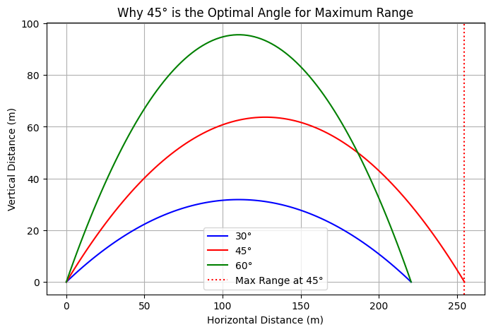
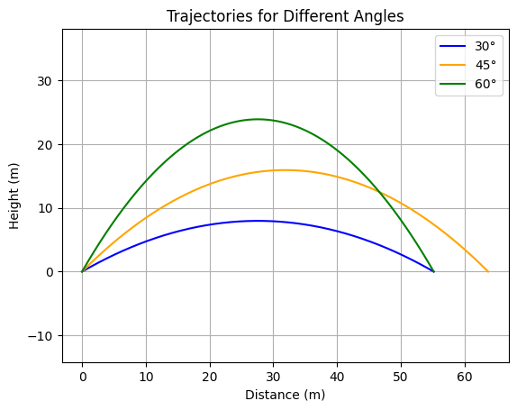
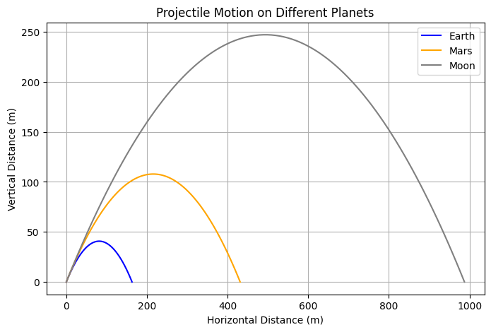
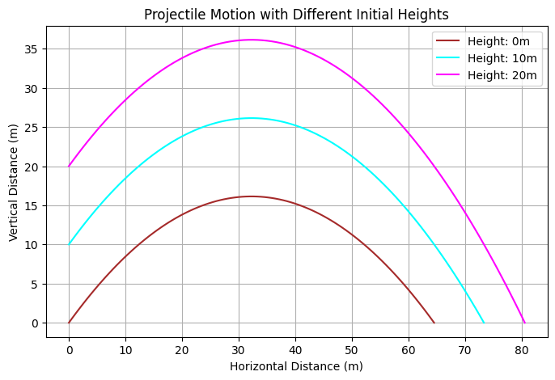
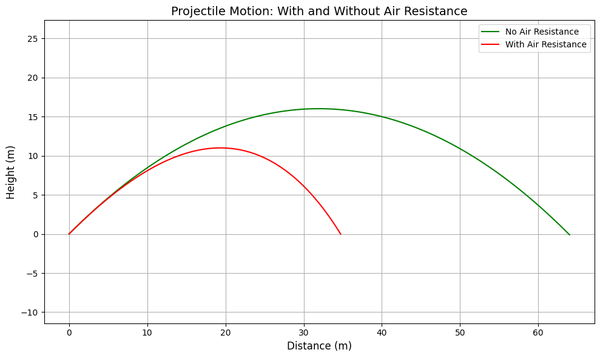
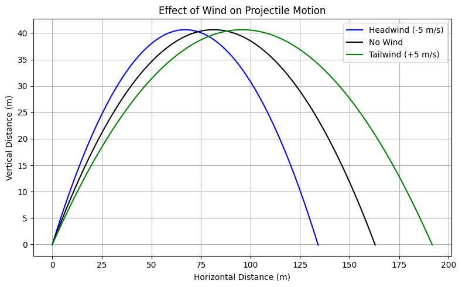
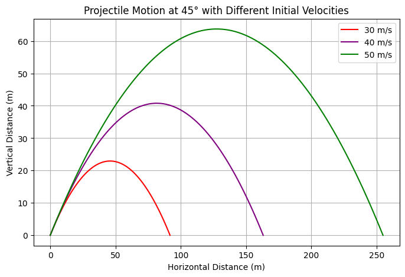

# Problem 1
# Investigating the Range as a Function of the Angle of Projection


## **1. Introduction**
Have you ever wondered how a soccer ball follows a curved path when kicked? Or how rockets and missiles follow precise trajectories? This is all because of **projectile motion**!  

In this report, i will **explore how the range of a projectile depends on the launch angle** and break it down step by step.

---

## **2. What is Projectile Motion?**
Projectile motion happens when an object is launched into the air and moves under the influence of **gravity**. The motion can be split into two parts:

- **Horizontal motion**: The object moves forward with a constant speed.

- **Vertical motion**: The object moves up and down due to gravity.

To understand projectile motion better, let's derive some important equations.

---

## **3. Key Equations of Motion** 

### **3.1 Breaking Motion into Components**
If an object is launched with an **initial speed** $v_0$ at an **angle** $\theta$, we can break this velocity into:

- **Horizontal velocity**: $v_x=v_0\cos\theta$

- **Vertical velocity**: $v_y=v_0\sin\theta$

Since gravity **only affects vertical motion**, the horizontal velocity **stays constant**.

---

### **3.2 Equations for Position and Velocity**
Using basic physics formulas, we get:

1️⃣ **Horizontal position (distance traveled in time $t$)**:

$$x=v_0\cos\theta\cdot t$$

2️⃣ **Vertical position (height at time $t$)**: 

$$y=v_0\sin\theta\cdot t-\frac{1}{2}gt^2$$

3️⃣ **Velocity in the horizontal direction** (always constant):  

$$v_x=v_0\cos\theta$$

4️⃣ **Velocity in the vertical direction** (changes due to gravity): 

$$v_y=v_0\sin\theta-gt$$

---

### **3.3 Finding Special Points**
Now let's look at some important moments in the projectile’s motion.

✔️ **Time of Flight** (How long the object stays in the air): 

$$t_f=\frac{2v_0\sin\theta}{g}$$  

✔️ **Maximum Height** (The highest point the object reaches): 

$$H=\frac{(v_0\sin\theta)^2}{2g}$$  

✔️ **Range (Total Distance the Object Travels Before Hitting the Ground)**:

$$R=\frac{v_0^2\sin(2\theta)}{g}$$  

#### Interesting Fact: The projectile travels the longest distance when launched at 45° because $\sin(2\theta)$ is largest at this angle.
 
#### Why Does a Projectile Travel the Farthest at 45°?

#### 🔹 The Optimal Angle: **45°**
At **45°**, the velocity is split **equally** between horizontal and vertical directions, creating the perfect balance between **airtime and forward motion**.

Mathematically, the **range** of a projectile is given by:

$$ R = \frac{v_0^2 \sin 2\theta}{g} $$

where:

- $R$ = range of the projectile,
- $v_0$ = initial velocity,
- $\theta$ = launch angle,
- $g$ = acceleration due to gravity.

The function $\sin 2\theta$ reaches its **maximum value** when:

$$ 2\theta = 90^\circ \quad \Rightarrow \quad \theta = 45^\circ $$

Thus, a projectile launched at **45°** travels the **farthest distance** because it achieves the **optimal balance** between horizontal and vertical motion. 




---

## **4. Family of Solutions**
The equations above describe a **family of solutions** depending on different values of:

1. **Launch speed ($v_0$)**: Faster projectiles travel farther and higher.
The initial speed determines the **kinetic energy** and range:

- **$v_0 = 15$ m/s** → short trajectory
- **$v_0 = 20$ m/s** → medium
- **$v_0 = 25$ m/s** → long and high trajectory


2. **Launch angle ($\theta$)**: Determines the shape of the trajectory.
The launch angle determines how the initial speed is split into horizontal and vertical components:

- **Low angle (30°)**: Strong horizontal motion, short airtime → low flat trajectory.
- **Optimal angle (45°)**: Perfect balance of height and range → maximum horizontal distance.
- **High angle (60°)**: High arc, longer airtime but shorter range.




3. **Gravity ($g$)**: Affects how quickly the projectile falls.
 The gravitational pull affects both **maximum height** and **time of flight**.

| Planet 🌍 | Gravity $g$ (m/s²) |
|----------|--------------------|
| Earth    | 9.81               |
| Mars     | 3.71               |
| Moon     | 1.62               |

- On the **Moon**, projectiles rise higher and stay in the air much longer.
- On **Mars**, the behavior is intermediate between Moon and Earth.



4. **Initial height ($h$)**: Changes the total flight time and range.
Initial height $h$ changes how far the projectile travels **before hitting the ground**.

- **$h = 0$ m**: Launch from ground.
- **$h = 10$ m**: Launch from a platform.
- **$h = 20$ m**: Launch from a rooftop/mountain.




By adjusting these values, we get **different possible trajectories**, from low and fast motions (like bullets) to high and slow ones (like thrown balls).

---

## **5. Limitations of the Idealized Model**
The equations we used assume an **ideal world** where:

❌ **No air resistance**: In reality, air slows down projectiles.  
❌ **Flat ground assumption**: The model assumes the projectile lands at the same height.  
❌ **Constant gravity ($g$)**: Gravity actually changes with altitude.  

Because of these assumptions, our equations give **approximate results** in the real world.

---

## **6. Extending the Model: Real-World Effects**
To make the model more **realistic**, we can add:

✅ **Air Resistance (Drag Force)**  

   - The force slows the projectile down.  
   - The drag force is proportional to the square of the velocity:  

$$F_d=\frac{1}{2} C_d \rho A v^2$$  

where $C_d$ is the drag coefficient, $\rho$ is air density, and $A$ is the cross-sectional area.  





✅ **Wind Effects**  

- A tailwind increases range, while a headwind decreases it.  
- A **tailwind** adds to horizontal velocity → increases range.
- A **headwind** subtracts → reduces distance.
- **Crosswind**: affects side motion (not modeled here but relevant in real life).

   

✅ **Launch Altitude**  

   - At high altitudes, air resistance is lower, and gravity is weaker, so objects travel **farther**.  

✅ **Rotation of the Earth (Coriolis Effect)** 

   - Important for long-range artillery and missiles.

 On a rotating Earth, especially at large scales (e.g., missiles, satellites), the Coriolis force causes the projectile to deviate:
- In the Northern Hemisphere: rightward deflection.
- In the Southern Hemisphere: leftward deflection.
  

---

## **7. Real-World Applications 🌍**
Projectile motion is not just for physics classes! It applies to:

- **Sports**: How football players kick the ball at different angles.

- **Military**: How missiles and bullets are fired for maximum range.

- **Space Exploration**: How rockets are launched at precise angles.

---


# Phython Implimentation

```python
import numpy as np
import matplotlib.pyplot as plt

# Constants
g = 9.81  # Gravity (m/s^2)
angles = [45]  # Fixed launch angle
velocities = [30, 40, 50]  # Different initial velocities (m/s)
colors = ['red', 'purple', 'green']  # Colors for different trajectories

plt.figure(figsize=(8, 5))

# Loop through each velocity and plot trajectory
for v0, color in zip(velocities, colors):
    t_flight = 2 * v0 * np.sin(np.radians(angles[0])) / g  # Time of flight
    t = np.linspace(0, t_flight, num=100)  # Time intervals
    x = v0 * np.cos(np.radians(angles[0])) * t  # Horizontal distance
    y = v0 * np.sin(np.radians(angles[0])) * t - 0.5 * g * t**2  # Vertical distance

    plt.plot(x, y, label=f'{v0} m/s', color=color)

# Labels and grid
plt.xlabel("Horizontal Distance (m)")
plt.ylabel("Vertical Distance (m)")
plt.title("Projectile Motion at 45° with Different Initial Velocities")
plt.legend()
plt.grid()
plt.show()

```

## Plot



---

## **8. Conclusion**
Now we u understand the key ideas behind projectile motion:

- **It has both horizontal and vertical movement**.

- **Gravity only affects the vertical motion**.

- **The best angle for the longest range is 45°**.

- **The initial speed, angle, and gravity all affect the motion**.

- **The real world includes air resistance, wind, and altitude effects**.

Understanding these principles helps in designing better sports strategies, video game physics, and even launching space missions! 

---