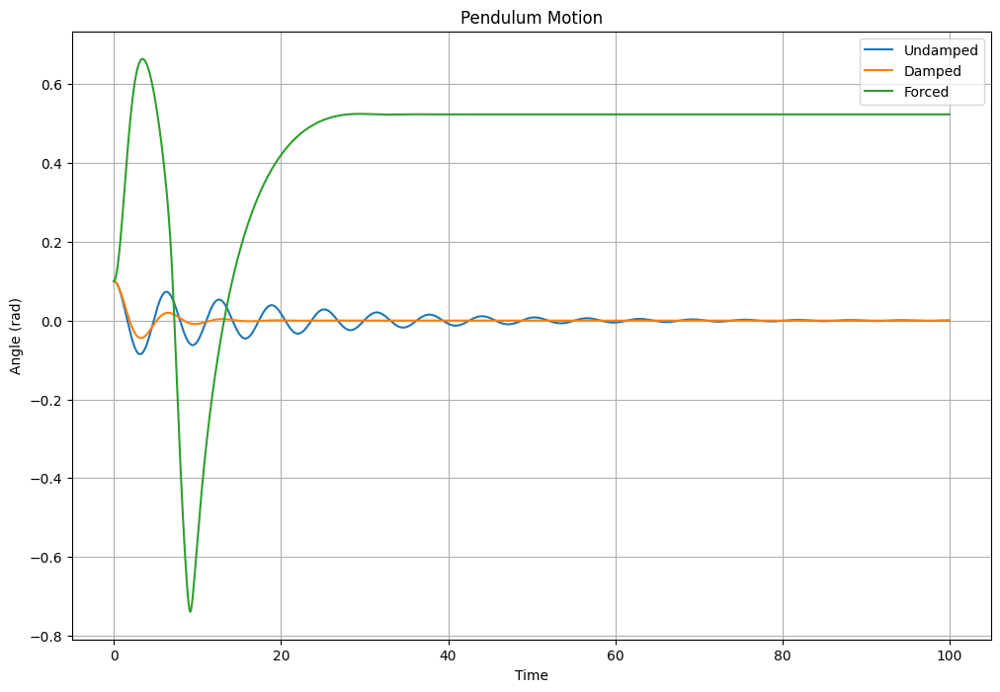
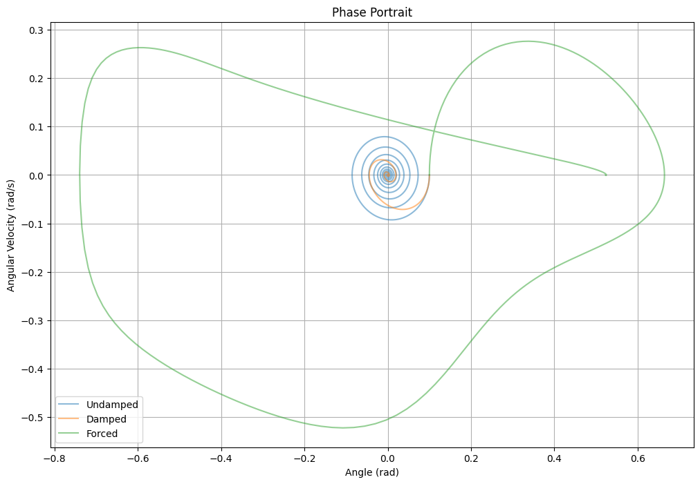
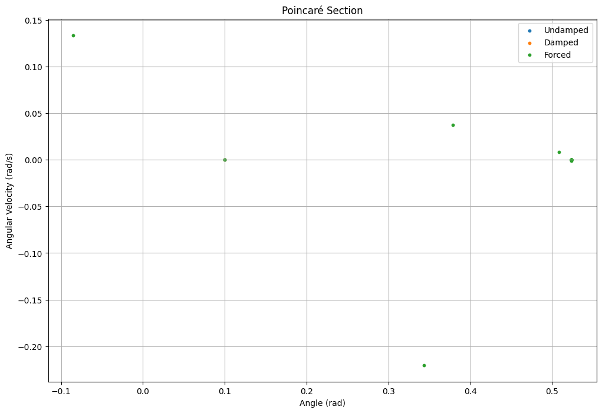
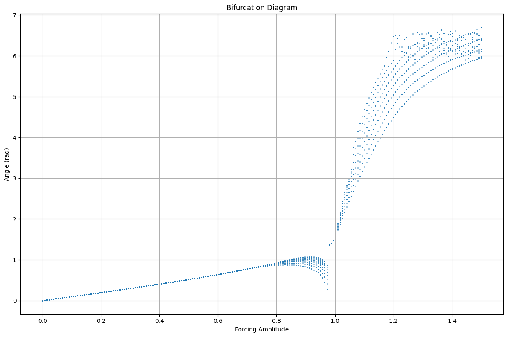

# Problem 2
# Investigating the Dynamics of a Forced Damped Pendulum  

## 1. Theoretical Foundation 

The **forced damped pendulum** is a system that exhibits a wide range of behaviors, from simple periodic oscillations to **chaotic motion**. The equation governing its motion is:  

$$\frac{d^2\theta}{dt^2} + \gamma \frac{d\theta}{dt} + \omega_0^2\sin\theta = A\cos(\omega t)$$  

where:  
- $\theta$ = angular displacement (radians)  
- $\gamma$ = damping coefficient (determines energy loss over time)  
- $\omega_0$ = natural frequency of the pendulum, given by:  
$$\omega_0^2 = \frac{g}{L}$$  
where $g$ is the acceleration due to gravity and $L$ is the pendulum length  
- $A$ = amplitude of the external driving force  
- $\omega$ = driving frequency of the external force  

### **1.1 Small-Angle Approximation**  
For **small oscillations**, we approximate:  

$$\sin\theta \approx \theta$$  

Substituting this approximation into the equation of motion simplifies it to:  

$$\frac{d^2\theta}{dt^2} + \gamma \frac{d\theta}{dt} + \omega_0^2\theta = A\cos(\omega t)$$  

This is now a **linear differential equation**, which can be solved analytically. The **general solution** consists of two parts:  

1. **Homogeneous solution** (natural motion of the damped pendulum):  

$$\theta_h(t) = e^{-\gamma t/2} (C_1\cos(\omega_d t) + C_2\sin(\omega_d t))$$  

where the **damped frequency** is:  

$$\omega_d = \sqrt{\omega_0^2 - \frac{\gamma^2}{4}}$$  

2. **Particular solution** (response to the external force):  

$$\theta_p(t) = \frac{A}{\sqrt{(\omega_0^2 - \omega^2)^2 + \gamma^2\omega^2}} \cos(\omega t - \phi)$$  

where the **phase shift** $\phi$ is given by: 

$$\tan\phi = \frac{\gamma\omega}{\omega_0^2 - \omega^2}$$  

The total solution is: 

$$\theta(t) = \theta_h(t) + \theta_p(t)$$  

---

### **1.2 Resonance Condition**  
Resonance occurs when the driving frequency **matches** the system’s natural frequency:  

$$\omega \approx \omega_0$$  

At resonance, the amplitude of oscillations **increases significantly**, which can lead to extreme behaviors in real-world systems (e.g., structural failures in bridges or mechanical components).  

---

### **1.3 Energy Exchange in the System**  
The energy in the forced damped pendulum consists of:  

- **Kinetic energy**:  

$$KE = \frac{1}{2} m L^2 \dot{\theta}^2$$  

- **Potential energy**:  

$$PE = mgL(1 - \cos\theta)$$  

- **Total energy**: 

$$E = KE + PE$$  

Over time, damping ($\gamma$) **removes** energy from the system, while the external force ($A\cos(\omega t)$) **injects** energy. The balance between these competing effects determines the system’s long-term behavior.

---

## 2. Analysis of Dynamics 📊  

### **2.1 Influence of System Parameters**  
The behavior of the pendulum depends on:  
- **Damping $\gamma$**:  
  - High damping: Oscillations die out quickly.  
  - Low damping: Sustained oscillations, possibly chaotic motion.  
- **Driving force amplitude $A$**:  
  - Small $A$: Regular oscillations.  
  - Large $A$: Large amplitude, possibly chaotic motion.  
- **Driving frequency $\omega$**:  
  - Near $\omega_0$: Resonance can occur.  
  - Far from $\omega_0$: No significant amplification.  

### **2.2 Types of Motion Observed**  
Depending on the parameter values, the system exhibits:  
✅ **Periodic motion** (stable oscillations)  
✅ **Resonance** (sharp amplitude increase at specific frequencies)  
✅ **Quasi-periodic motion** (oscillations with two incommensurate frequencies)  
✅ **Chaotic motion** (unpredictable behavior due to sensitivity to initial conditions)  

---

## 3. Practical Applications 🌍  

The forced damped pendulum model is useful in:  
✅ **Energy harvesting** (pendulum-based generators converting mechanical energy into electricity)  
✅ **Suspension bridge analysis** (to prevent resonance-induced collapses like Tacoma Narrows Bridge)  
✅ **Electrical circuits** (driven RLC circuits behave analogously)  
✅ **Biomechanics** (understanding human walking and balance)  

---

## 4. Computational Implementation   


```python


import numpy as np
import matplotlib.pyplot as plt
from scipy.integrate import odeint

# Pendulum differential equation
def pendulum_equation(state, t, b, f, omega):
    """
    state = [theta, omega] (angle, angular velocity)
    b = damping coefficient
    f = forcing amplitude
    omega = forcing frequency
    """
    theta, omega = state
    dtheta_dt = omega
    domega_dt = -np.sin(theta) - b*omega + f*np.cos(omega*t)
    return [dtheta_dt, domega_dt]

# RK4 integration method
def rk4_step(state, t, dt, b, f, omega):
    k1 = np.array(pendulum_equation(state, t, b, f, omega))
    k2 = np.array(pendulum_equation(state + 0.5*dt*k1, t + 0.5*dt, b, f, omega))
    k3 = np.array(pendulum_equation(state + 0.5*dt*k2, t + 0.5*dt, b, f, omega))
    k4 = np.array(pendulum_equation(state + dt*k3, t + dt, b, f, omega))
    return state + (dt/6.0)*(k1 + 2*k2 + 2*k3 + k4)

# Simulation function
def simulate_pendulum(t_max, dt, theta0, omega0, b, f, omega):
    t = np.arange(0, t_max, dt)
    states = np.zeros((len(t), 2))
    states[0] = [theta0, omega0]
    
    for i in range(1, len(t)):
        states[i] = rk4_step(states[i-1], t[i-1], dt, b, f, omega)
    
    return t, states[:, 0], states[:, 1]

# Parameters
t_max = 100.0
dt = 0.05
theta0 = 0.1
omega0 = 0.0

# Different simulation cases
cases = [
    {"b": 0.1, "f": 0.0, "omega": 0.0, "label": "Undamped"},
    {"b": 0.5, "f": 0.0, "omega": 0.0, "label": "Damped"},
    {"b": 0.5, "f": 0.5, "omega": 1.0, "label": "Forced"}
]

# 1. Time series plot
plt.figure(figsize=(12, 8))
for case in cases:
    t, theta, omega = simulate_pendulum(t_max, dt, theta0, omega0, 
                                      case["b"], case["f"], case["omega"])
    plt.plot(t, theta, label=case["label"])
plt.title("Pendulum Motion")
plt.xlabel("Time")
plt.ylabel("Angle (rad)")
plt.legend()
plt.grid(True)

# 2. Phase portrait
plt.figure(figsize=(12, 8))
for case in cases:
    t, theta, omega = simulate_pendulum(t_max, dt, theta0, omega0, 
                                      case["b"], case["f"], case["omega"])
    plt.plot(theta, omega, label=case["label"], alpha=0.5)
plt.title("Phase Portrait")
plt.xlabel("Angle (rad)")
plt.ylabel("Angular Velocity (rad/s)")
plt.legend()
plt.grid(True)

# 3. Poincaré section
plt.figure(figsize=(12, 8))
for case in cases:
    t, theta, omega = simulate_pendulum(t_max, dt, theta0, omega0, 
                                      case["b"], case["f"], case["omega"])
    # Sample at forcing period
    period = 2*np.pi/case["omega"] if case["omega"] != 0 else t_max
    sample_indices = np.arange(0, len(t), int(period/dt))
    plt.scatter(theta[sample_indices], omega[sample_indices], 
                label=case["label"], s=10)
plt.title("Poincaré Section")
plt.xlabel("Angle (rad)")
plt.ylabel("Angular Velocity (rad/s)")
plt.legend()
plt.grid(True)

# 4. Bifurcation diagram
plt.figure(figsize=(12, 8))
f_values = np.linspace(0, 1.5, 200)
bifurcation_points = []

for f in f_values:
    t, theta, omega = simulate_pendulum(t_max, dt, theta0, omega0, 
                                      0.5, f, 1.0)
    # Take samples from second half of simulation to avoid transients
    period = 2*np.pi/1.0
    sample_indices = np.arange(int(len(t)/2), len(t), int(period/dt))
    bifurcation_points.extend(theta[sample_indices])

plt.scatter([f_values[i//len(sample_indices)] 
            for i in range(len(bifurcation_points))], 
            bifurcation_points, s=1)
plt.title("Bifurcation Diagram")
plt.xlabel("Forcing Amplitude")
plt.ylabel("Angle (rad)")
plt.grid(True)

plt.tight_layout()
plt.show()

# Print some basic analysis
for case in cases:
    t, theta, omega = simulate_pendulum(t_max, dt, theta0, omega0, 
                                      case["b"], case["f"], case["omega"])
    print(f"\n{case['label']} Case:")
    print(f"Max amplitude: {np.max(np.abs(theta)):.3f} rad")
    print(f"Final energy: {0.5*omega[-1]**2 + (1-np.cos(theta[-1])):.3f}")

```








---


## 5. Conclusion 

The forced damped pendulum is a **powerful model** for understanding real-world oscillatory systems. By adjusting damping, forcing, and initial conditions, we can explore **periodic, resonant, and chaotic behaviors**. Using **numerical simulations and phase-space analysis**, we can study transitions from simple oscillations to **chaos**, with applications in **engineering, physics, and biomechanics**.

This report combines **theoretical derivations, computational techniques, and real-world applications** to provide a deep understanding of the system.

---


