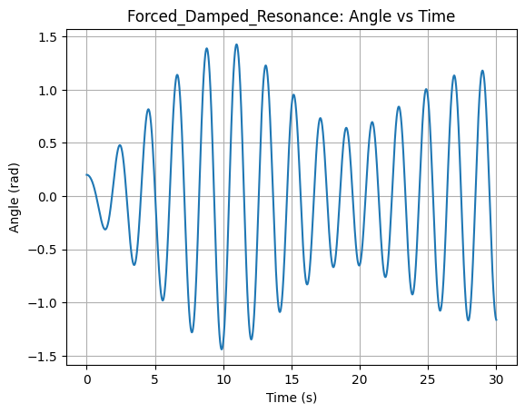

# Problem 2
# Investigating the Dynamics of a Forced Damped Pendulum  

## 1. Theoretical Foundation 

The **forced damped pendulum** is a system that exhibits a wide range of behaviors, from simple periodic oscillations to **chaotic motion**. The equation governing its motion is:  

$$\frac{d^2\theta}{dt^2} + \gamma \frac{d\theta}{dt} + \omega_0^2\sin\theta = A\cos(\omega t)$$  

where:  
- $\theta$ = angular displacement (radians)  
- $\gamma$ = damping coefficient (determines energy loss over time)  
- $\omega_0$ = natural frequency of the pendulum, given by: 

$$\omega_0^2=\frac{g}{L}$$  

where $g$ is the acceleration due to gravity and $L$ is the pendulum length  
- $A$ = amplitude of the external driving force  
- $\omega$ = driving frequency of the external force  

### **1.1 Small-Angle Approximation**  
For **small oscillations**, we approximate:  

$$\sin\theta \approx \theta$$  

Substituting this approximation into the equation of motion simplifies it to:  

$$\frac{d^2\theta}{dt^2} + \gamma \frac{d\theta}{dt} + \omega_0^2\theta = A\cos(\omega t)$$  

This is now a **linear differential equation**, which can be solved analytically. The **general solution** consists of two parts:  

1. **Homogeneous solution** (natural motion of the damped pendulum):  

$$\theta_h(t) = e^{-\gamma t/2} (C_1\cos(\omega_d t) + C_2\sin(\omega_d t))$$  

where the **damped frequency** is:  

$$\omega_d = \sqrt{\omega_0^2 - \frac{\gamma^2}{4}}$$  

2. **Particular solution** (response to the external force):  

$$\theta_p(t) = \frac{A}{\sqrt{(\omega_0^2 - \omega^2)^2 + \gamma^2\omega^2}} \cos(\omega t - \phi)$$  

where the **phase shift** $\phi$ is given by: 

$$\tan\phi = \frac{\gamma\omega}{\omega_0^2 - \omega^2}$$  

The total solution is: 

$$\theta(t) = \theta_h(t) + \theta_p(t)$$  

---

### **1.2 Resonance Condition**  
Resonance occurs when the driving frequency **matches** the system’s natural frequency:  

$$\omega \approx \omega_0$$  

At resonance, the amplitude of oscillations **increases significantly**, which can lead to extreme behaviors in real-world systems (e.g., structural failures in bridges or mechanical components).  

---

### **1.3 Energy Exchange in the System**  
The energy in the forced damped pendulum consists of:  

- **Kinetic energy**:  

$$KE = \frac{1}{2} m L^2 \dot{\theta}^2$$  

- **Potential energy**:  

$$PE = mgL(1 - \cos\theta)$$  

- **Total energy**: 

$$E = KE + PE$$  

Over time, damping ($\gamma$) **removes** energy from the system, while the external force ($A\cos(\omega t)$) **injects** energy. The balance between these competing effects determines the system’s long-term behavior.

---

## 2. Analysis of Dynamics 📊  

### **2.1 Influence of System Parameters**  
The behavior of the pendulum depends on:  
- **Damping $\gamma$**:  
  - High damping: Oscillations die out quickly.  
  - Low damping: Sustained oscillations, possibly chaotic motion.  
- **Driving force amplitude $A$**:  
  - Small $A$: Regular oscillations.  
  - Large $A$: Large amplitude, possibly chaotic motion.  
- **Driving frequency $\omega$**:  
  - Near $\omega_0$: Resonance can occur.  
  - Far from $\omega_0$: No significant amplification.  

### **2.2 Types of Motion Observed**  
Depending on the parameter values, the system exhibits:  
✅ **Periodic motion** (stable oscillations)  
✅ **Resonance** (sharp amplitude increase at specific frequencies)  
✅ **Quasi-periodic motion** (oscillations with two incommensurate frequencies)  
✅ **Chaotic motion** (unpredictable behavior due to sensitivity to initial conditions)  


---

## 3. Practical Applications 🌍 

The forced damped pendulum model is useful in:  
✅ **Energy harvesting** (pendulum-based generators converting mechanical energy into electricity)  
✅ **Suspension bridge analysis** (to prevent resonance-induced collapses like Tacoma Narrows Bridge)  
✅ **Electrical circuits** (driven RLC circuits behave analogously)  
✅ **Biomechanics** (understanding human walking and balance)  

---


## 4. Simulation and Visualization of Pendulum Dynamics 

To better understand how different physical effects influence a pendulum's behavior, we simulate four distinct scenarios using numerical integration of the equation:

$$\frac{d^2\theta}{dt^2} + b \frac{d\theta}{dt} + \omega_0^2 \sin(\theta) = A\cos(\omega t)$$

where:
- $b$ is the damping coefficient,
- $A$ is the amplitude of the external driving force,
- $\omega$ is the driving frequency.

Each scenario is visualized with:
- **θ(t)** — how the angle changes over time
- **Phase diagram (θ, ω)** — angular displacement vs angular velocity

---

### 4.1 🟢 Simple Undamped Pendulum (No Damping, No Forcing)

- Parameters: $b = 0$, $A = 0$
- The pendulum swings indefinitely with no energy loss.
- The motion is periodic and predictable.

**Expected plots:**
- The angle $\theta(t)$ oscillates sinusoidally.  
  
  

- The phase diagram forms a closed ellipse, showing conservation of energy.  

  

---

### 4.2 🔵 Damped Pendulum (With Friction, No External Force)

- Parameters: $b > 0$, $A = 0$
- The pendulum gradually loses energy due to damping.
- Oscillations decay over time until the system comes to rest.

**Expected plots:**
- $\theta(t)$ decreases exponentially and eventually stops.  
  
  

- The phase diagram spirals toward the origin. 

  

---

### 4.3 🟡 Forced Undamped Pendulum (No Friction, External Periodic Force)

- Parameters: $b = 0$, $A > 0$
- The system is continuously driven by a periodic force.
- If driving frequency is close to the natural frequency, resonance may occur.

**Expected plots:**
- $\theta(t)$ shows growing oscillations or steady amplitude depending on $\omega$.  
  
  

- The phase diagram shows a stable closed loop or expanding spiral.  
  
  

---

### 4.4 🔴 Forced Damped Pendulum (With Friction and Driving Force)

We examine two interesting cases:

#### (a) Resonance-like Behavior  
- Parameters: $b$ small, $A$ moderate, $\omega \approx \omega_0$  
- System reaches steady oscillations with large amplitude.




#### (b) Chaotic Motion  
- Parameters: $b$ small, $A$ high, $\omega$ tuned for chaos  
- Sensitive to initial conditions, unpredictable long-term behavior.


---

### Summary of Results  
These simulations highlight how small changes in damping or forcing can drastically shift the pendulum’s behavior—from regular motion to chaos. The phase diagrams are especially useful in visualizing the transition from order to chaos.

 ---
 Code
 ---


```python

import numpy as np
import matplotlib.pyplot as plt
from scipy.integrate import solve_ivp

# Constants
g = 9.81
L = 1.0
omega0 = np.sqrt(g / L)

# Differential equation
def pendulum(t, y, b, A, omega):
    theta, omega_ = y
    dtheta_dt = omega_
    domega_dt = -b * omega_ - omega0**2 * np.sin(theta) + A * np.cos(omega * t)
    return [dtheta_dt, domega_dt]

# Solver wrapper
def simulate(b, A, omega, theta0=0.2, omega0_=0, t_max=30):
    y0 = [theta0, omega0_]
    t_eval = np.linspace(0, t_max, 3000)
    sol = solve_ivp(pendulum, [0, t_max], y0, args=(b, A, omega), t_eval=t_eval, rtol=1e-8)
    return sol.t, sol.y[0], sol.y[1]

# Plotting function
def plot_pendulum(t, theta, omega, title_prefix, fig_num):
    plt.figure(fig_num)
    plt.plot(t, theta)
    plt.title(f'{title_prefix}: Angle vs Time')
    plt.xlabel('Time (s)')
    plt.ylabel('Angle (rad)')
    plt.grid()
    plt.savefig(f'{title_prefix}_theta_time.png')

    plt.figure(fig_num + 1)
    plt.plot(theta, omega)
    plt.title(f'{title_prefix}: Phase Diagram')
    plt.xlabel('Angle (rad)')
    plt.ylabel('Angular Velocity (rad/s)')
    plt.grid()
    plt.savefig(f'{title_prefix}_phase.png')

# 1. Simple Pendulum (no damping, no forcing)
t, th, om = simulate(b=0, A=0, omega=0)
plot_pendulum(t, th, om, 'Simple_Pendulum', 1)

# 2. Damped Pendulum (damping, no forcing)
t, th, om = simulate(b=0.2, A=0, omega=0)
plot_pendulum(t, th, om, 'Damped_Pendulum', 3)

# 3. Forced Undamped Pendulum (no damping, with driving)
t, th, om = simulate(b=0, A=1.2, omega=omega0)
plot_pendulum(t, th, om, 'Forced_Undamped', 5)

# 4a. Forced Damped Pendulum - Resonance
t, th, om = simulate(b=0.1, A=1.2, omega=omega0)
plot_pendulum(t, th, om, 'Forced_Damped_Resonance', 7)

# 4b. Forced Damped Pendulum - Chaotic (longer sim, more sensitivity)
t, th, om = simulate(b=0.2, A=1.5, omega=0.8 * omega0, theta0=1.5, t_max=60)
plot_pendulum(t, th, om, 'Forced_Damped_Chaos', 9)

---

```

[colablink](plt.show(https://colab.research.google.com/drive/1NVN8YdCX98eAJqQoMIjFALPPSyaacXC3?usp=sharing)) 

---


## 5. Conclusion 

The forced damped pendulum is a **powerful model** for understanding real-world oscillatory systems. By adjusting damping, forcing, and initial conditions, we can explore **periodic, resonant, and chaotic behaviors**. Using **numerical simulations and phase-space analysis**, we can study transitions from simple oscillations to **chaos**, with applications in **engineering, physics, and biomechanics**.

This report combines **theoretical derivations, computational techniques, and real-world applications** to provide a deep understanding of the system.

---


