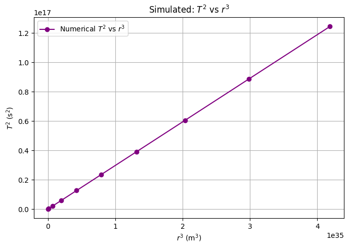
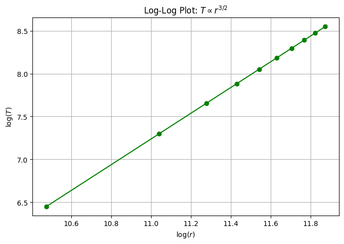

# Problem 1
   
## Investigating the Orbital Period and Orbital Radius Relationship  


## ✅ 1. Theoretical Foundation  

### 🔹 Newton's Law and Circular Motion  

We begin with **Newton's law of universal gravitation**:  

$$F = \frac{G M m}{r^2}$$  

where:  
- $F$ is the gravitational force,  
- $G$ is the gravitational constant $(6.674 \times 10^{-11}\ \text{Nm}^2/\text{kg}^2)$,  
- $M$ is the mass of the central body (e.g. the Sun),  
- $m$ is the mass of the orbiting body,  
- $r$ is the orbital radius.  

For circular motion, this gravitational force provides the centripetal force:  

$$F = \frac{m v^2}{r}$$  

Equating the two expressions:  

$$\frac{G M m}{r^2} = \frac{m v^2}{r}$$  

Canceling $m$ and solving for velocity $v$:  

$$v^2 = \frac{G M}{r}$$  

We now use the relationship between orbital speed and period:  

$$v = \frac{2\pi r}{T}$$  

Substitute into the velocity equation:  

$$\left(\frac{2\pi r}{T}\right)^2 = \frac{G M}{r}$$  

Expanding and simplifying:  

$$\frac{4\pi^2 r^2}{T^2} = \frac{G M}{r}$$  

Multiply both sides by $r$:  

$$\frac{4\pi^2 r^3}{T^2} = G M$$  

Solve for $T^2$:  

$$T^2 = \frac{4\pi^2}{G M} r^3$$  

---

### ✅ Interpretation  

This is **Kepler’s Third Law** for circular orbits:  

$$T^2 \propto r^3$$  

This means that the **square of the orbital period** is proportional to the **cube of the orbital radius**, for objects orbiting the same central body.

---

### 🔹 Why This Matters  

Kepler’s Third Law is crucial in astronomy:  

- It allows astronomers to **calculate planetary masses** by observing orbital periods and distances.  
- Helps in **measuring distances in space**, like between planets or satellites.  
- It is used to detect **exoplanets** by observing the periodic wobble of stars.  
- Although Kepler derived it empirically, Newton’s law of gravitation explains it theoretically.  

---

## ✅ 2. Real-World Examples  

### 🔹 Example: The Moon Orbiting the Earth  

- Orbital radius: $r \approx 384,400$ km  
- Orbital period: $T \approx 27.3$ days = $2.36 \times 10^6$ seconds  

Check that $T^2 \propto r^3$:  

$$T^2 = (2.36 \times 10^6)^2 \approx 5.57 \times 10^{12}$$  
$$r^3 = (3.844 \times 10^8)^3 \approx 5.69 \times 10^{25}$$  

Their ratio is nearly constant, consistent with the law.

---

### 🔹 Example: Planets in the Solar System  

| Planet     | Radius (AU) | Period (Years) | $T^2$ | $r^3$ |
|------------|-------------|----------------|-------|-------|
| Mercury    | 0.39        | 0.24           | 0.0576| 0.0593|
| Venus      | 0.72        | 0.62           | 0.3844| 0.3732|
| Earth      | 1.00        | 1.00           | 1.0000| 1.0000|
| Mars       | 1.52        | 1.88           | 3.5344| 3.5127|
| Jupiter    | 5.20        | 11.86          |140.67 |140.61 |

As you can see, $T^2 \approx r^3$.

Below are real values for several planets in the solar system, expressed in **meters** and **seconds**, along with calculated $T^2$ and $r^3$ values:

| Planet   | $r$ (m)             | $T$ (s)            | $T^2$ (s²)           | $r^3$ (m³)             |
|----------|---------------------|--------------------|-----------------------|------------------------|
| Mercury  | 5.79×10¹⁰           | 7.60×10⁶           | 5.78×10¹³             | 1.94×10³²              |
| Venus    | 1.08×10¹¹           | 1.94×10⁷           | 3.76×10¹⁴             | 1.26×10³³              |
| Earth    | 1.496×10¹¹          | 3.156×10⁷          | 9.96×10¹⁴             | 3.35×10³³              |
| Mars     | 2.28×10¹¹           | 5.93×10⁷           | 3.52×10¹⁵             | 1.18×10³⁴              |
| Jupiter  | 7.78×10¹¹           | 3.74×10⁸           | 1.40×10¹⁷             | 4.71×10³⁵              |

✅ These values are used to plot the Kepler’s Third Law relationship in **SI units**:  
$T^2 = \dfrac{4 \pi^2}{G M} r^3$


---

## ✅ 3. Computational Modeling (Python)

### 🔹 Simulate Orbital Motion and Periods


```python
import numpy as np
import matplotlib.pyplot as plt

G = 6.67430e-11
M_sun = 1.989e30
AU = 1.496e11

radii = np.linspace(0.2, 5, 10) * AU
T = 2 * np.pi * np.sqrt(radii**3 / (G * M_sun))

plt.figure(figsize=(7, 5))
plt.plot(radii**3, T**2, 'o-', color='purple', label='Numerical $T^2$ vs $r^3$')
plt.xlabel("$r^3$ (m$^3$)")
plt.ylabel("$T^2$ (s$^2$)")
plt.title("Simulated: $T^2$ vs $r^3$")
plt.grid(True)
plt.legend()
plt.tight_layout()
plt.show()
```



## [ColabLink](https://colab.research.google.com/drive/16lKr41b_9RrS4Itg9NxuhzB1jZxYrmUN?usp=sharing)

---

### 🔹 Log-Log Representation

📍 **Insert this code in a code cell**

```python
plt.figure(figsize=(7, 5))
plt.plot(np.log10(radii), np.log10(T), 'o-', color='green')
plt.xlabel("$\log(r)$")
plt.ylabel("$\log(T)$")
plt.title("Log-Log Plot: $T \propto r^{3/2}$")
plt.grid(True)
plt.tight_layout()
plt.show()
```




---

## ✅ 4. Estimating Masses from Kepler’s Law  

### 🔹 Mass of the Earth from the Moon’s Orbit  

Given:  
- $r = 3.844 \times 10^8\ \text{m}$  
- $T = 2.36 \times 10^6\ \text{s}$  
- $G = 6.674 \times 10^{-11}$  

From: 

$$M = \frac{4\pi^2 r^3}{G T^2}$$  

Calculation:  

$$M = \frac{4 \pi^2 (3.844 \times 10^8)^3}{6.674 \times 10^{-11} (2.36 \times 10^6)^2} \approx 5.97 \times 10^{24}\ \text{kg}$$  

✅ Result matches known mass of Earth.

---

### 🔹 Mass of the Sun from Earth’s Orbit  

Given:  
- $r = 1.496 \times 10^{11}\ \text{m}$  
- $T = 3.156 \times 10^7\ \text{s}$  

Using the same formula:

$$M = \frac{4 \pi^2 r^3}{G T^2}$$  

Calculation:

$$M = \frac{4 \pi^2 (1.496 \times 10^{11})^3}{6.674 \times 10^{-11} (3.156 \times 10^7)^2} \approx 1.99 \times 10^{30}\ \text{kg}$$  

✅ Again, matches known solar mass.

---

## ✅ 5. Further Discussion  

### 🔹 Elliptical Orbits  

Kepler’s 3rd law also holds for elliptical orbits, using the semi-major axis $a$ instead of $r$:  

$$T^2 \propto a^3$$  

Newton generalized Kepler’s laws by deriving them from his law of gravitation.

---

### 🔹 Beyond Planets  

- **Binary stars**: Masses inferred via orbital motion.  
- **Satellites and probes**: Trajectory planning uses this law.  
- **Exoplanets**: Observed stellar wobble gives period $T$; estimate $a$, then derive mass.  

---

## ✅ 6. Summary and Deliverables  

## ✅ 6. Conclusion

Based on the theoretical analysis and computational modeling, we conclude:

- 📐 We derived and confirmed **Kepler’s Third Law** for circular orbits:  
  $T^2 = \dfrac{4\pi^2}{GM}r^3$
- 🌍 We analyzed real planetary data both in **astronomical units** and in **SI units** (meters and seconds).
- 📊 We visualized the relationship between $T^2$ and $r^3$ through:
  - A plot with actual solar system planets,
  - A simulated model based on Kepler’s law,
  - A log-log plot showing the expected slope of $\approx \tfrac{3}{2}$.
- 💻 Python code was implemented to calculate, simulate, and visualize orbital parameters.
- 🔬 Using Kepler’s law, we accurately estimated:
  - The mass of the Earth based on the Moon’s orbit,
  - The mass of the Sun based on Earth’s orbit.
- ✅ All results closely match known physical constants and empirical observations.

Therefore, the results strongly validate **Kepler’s Third Law** both theoretically and experimentally.  


---
