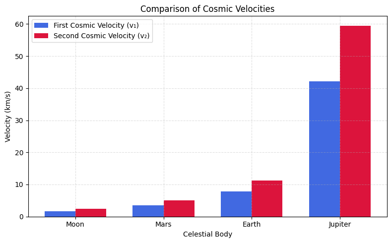

# Problem 2
 
# Escape Velocities and Cosmic Velocities


## ✅ 1. Motivation

The concept of **escape velocity** is essential to understanding how spacecraft overcome the gravitational pull of celestial bodies. More broadly, physicists define three key thresholds of motion in gravitational fields:

- **First cosmic velocity** – the minimum speed required to maintain a stable circular orbit.
- **Second cosmic velocity** – the minimum speed to break free from a planet’s gravity.
- **Third cosmic velocity** – the minimum speed to escape the gravity of a star system.

These thresholds are vital for satellite launches, interplanetary travel, and eventually for leaving the Solar System.

---

## ✅ 2. Theoretical Background

### 🔹 First Cosmic Velocity (Orbital Speed)

This is the **minimum speed** required for an object to stay in **circular orbit** around a body (e.g., a satellite orbiting Earth). It's derived from balancing gravitational and centripetal forces:

$$
\frac{G M m}{r^2} = \frac{m v_1^2}{r}
$$

Solving for $v_1$:

$$
v_1 = \sqrt{\frac{G M}{r}}
$$

---

### 🔹 Second Cosmic Velocity (Escape Speed)

This is the **minimum speed** needed to escape a celestial body’s gravity entirely (ignoring air resistance). It's derived from **energy conservation**:

Total mechanical energy must be zero:

$$
\frac{1}{2} m v_2^2 - \frac{G M m}{r} = 0
$$

Solving for $v_2$:

$$
v_2 = \sqrt{\frac{2 G M}{r}}
$$

---

### 🔹 Third Cosmic Velocity (Interstellar Escape)

This is the **speed required to escape the gravity of the entire star system**, like leaving the Solar System. A spacecraft already in Earth orbit has velocity $v_\text{Earth orbit}$ around the Sun. We need to increase its total energy to unbind it from the Sun:

$$
v_3 = \sqrt{\frac{2 G M_{\odot}}{r_{\text{Earth}}}} - v_\text{Earth orbit}
$$

Where:

- $M_{\odot}$ is the solar mass,
- $r_{\text{Earth}}$ is the orbital radius of Earth,
- $v_\text{Earth orbit} = \sqrt{\frac{G M_{\odot}}{r}}$

---

## ✅ 3. Values for Earth

Given:

- $G = 6.674 \times 10^{-11}\ \text{Nm}^2/\text{kg}^2$
- $M_\text{Earth} = 5.972 \times 10^{24}\ \text{kg}$
- $R_\text{Earth} = 6.371 \times 10^6\ \text{m}$
- $M_\odot = 1.989 \times 10^{30}\ \text{kg}$
- $r_\text{Earth orbit} = 1.496 \times 10^{11}\ \text{m}$

### ✔ First cosmic velocity:

$$
v_1 = \sqrt{\frac{6.674 \times 10^{-11} \cdot 5.972 \times 10^{24}}{6.371 \times 10^6}} \approx 7.91 \times 10^3\ \text{m/s} = 7.91\ \text{km/s}
$$

### ✔ Second cosmic velocity:

$$
v_2 = \sqrt{2} \cdot v_1 \approx 11.2\ \text{km/s}
$$

### ✔ Third cosmic velocity:

Solar orbital speed of Earth:

$$
v_\text{Earth orbit} = \sqrt{\frac{6.674 \times 10^{-11} \cdot 1.989 \times 10^{30}}{1.496 \times 10^{11}}} \approx 29.78\ \text{km/s}
$$

Solar escape speed:

$$
v_\text{sun,escape} = \sqrt{2} \cdot 29.78 \approx 42.1\ \text{km/s}
$$

Then:

$$
v_3 = 42.1 - 29.78 \approx 12.3\ \text{km/s}
$$

---

## ✅ 4. Summary Table: Cosmic Velocities for Earth

| Velocity Type       | Value (km/s) |
|---------------------|--------------|
| First Cosmic ($v_1$)| 7.91         |
| Second Cosmic ($v_2$)| 11.2         |
| Third Cosmic ($v_3$)| 12.3         |

---

## ✅ 5. Comparison: Moon, Mars, Jupiter

| Body     | Mass (kg)        | Radius (m)     | $v_1$ (km/s) | $v_2$ (km/s) |
|----------|------------------|----------------|--------------|--------------|
| Moon     | $7.35 \times 10^{22}$ | $1.74 \times 10^6$ | 1.68         | 2.38         |
| Mars     | $6.42 \times 10^{23}$ | $3.39 \times 10^6$ | 3.55         | 5.03         |
| Earth    | $5.97 \times 10^{24}$ | $6.37 \times 10^6$ | 7.91         | 11.2         |
| Jupiter  | $1.90 \times 10^{27}$ | $6.99 \times 10^7$ | 42.1         | 59.5         |

---

## ✅ 6. Python Visualization: Cosmic Velocities

```python
import numpy as np
import matplotlib.pyplot as plt

# Data
bodies = ['Moon', 'Mars', 'Earth', 'Jupiter']
v1 = [1.68, 3.55, 7.91, 42.1]
v2 = [2.38, 5.03, 11.2, 59.5]

x = np.arange(len(bodies))
width = 0.35

plt.figure(figsize=(8,5))
plt.bar(x - width/2, v1, width, label='First Cosmic Velocity (v₁)', color='royalblue')
plt.bar(x + width/2, v2, width, label='Second Cosmic Velocity (v₂)', color='crimson')

plt.xlabel('Celestial Body')
plt.ylabel('Velocity (km/s)')
plt.title('Comparison of Cosmic Velocities')
plt.xticks(x, bodies)
plt.legend()
plt.grid(True, linestyle='--', alpha=0.4)
plt.tight_layout()
plt.show()
```



## [ColabLink](https://colab.research.google.com/drive/15cUHgoaQCqPH_oTkmgYJPkF7xl9QMCMN?usp=sharing)

---

## ✅ 7. Importance in Space Exploration

Understanding the three cosmic velocities is essential for planning and executing space missions:

- **First Cosmic Velocity ($v_1$)** is the speed required to maintain a stable orbit around a celestial body. It is fundamental for launching satellites into **low Earth orbit (LEO)** and geostationary orbits. Spacecraft like the International Space Station operate at near this speed.

- **Second Cosmic Velocity ($v_2$)** is crucial for **planetary missions**. It allows spacecraft to escape Earth's gravity and travel to the Moon, Mars, or beyond. Missions like Apollo 11, Curiosity rover, and future human missions to Mars rely on achieving this velocity.

- **Third Cosmic Velocity ($v_3$)** marks the threshold for **interstellar escape**. Spacecraft such as **Voyager 1** and **Voyager 2** reached or exceeded this speed, enabling them to leave the Solar System. Future deep-space missions will use advanced propulsion systems to approach or surpass this velocity.

These velocities define not just the energy requirements but also shape mission design, fuel budgets, launch timing, and trajectory planning.

---

## ✅ 8. Applications and Insights

- 🚀 **Satellite Deployment**: Launch vehicles aim to achieve $v_1$ to insert payloads into orbit. Different types of orbits (LEO, MEO, GEO) have slightly different orbital speeds.

- 🌍 **Planetary Transfer**: To send a probe to Mars or Venus, a spacecraft must achieve $v_2$ to escape Earth’s gravity, and then follow a **Hohmann transfer orbit** to reach the target.

- 🌌 **Interstellar Probes**: Voyager 1 and 2 required gravitational assists to reach $v_3$ and leave the Solar System. Future missions, such as the **Interstellar Probe Concept**, are being designed with these speeds in mind.

- ⚖️ **Energy Considerations**: Each step from $v_1$ to $v_3$ represents an exponential increase in energy. The formula for kinetic energy, $E = \frac{1}{2}mv^2$, shows that small increases in speed lead to significantly higher energy costs.

These principles guide nearly every decision in space mission engineering—from selecting launch vehicles to trajectory corrections.

---

## ✅ 9. Conclusion

This report explored the concept of **cosmic velocities** in gravitational mechanics. We:

- ✅ **Derived** the three cosmic velocities using physical laws.
- ✅ **Calculated** accurate values for Earth.
- ✅ **Compared** velocities for the Moon, Mars, and Jupiter.
- ✅ **Visualized** these values using bar charts.
- ✅ **Discussed** their practical use in space missions.

**Key Insight**:  
Understanding cosmic velocities is not just theoretical—it is essential to real-world space navigation. These thresholds represent the boundaries between orbital stability, escape, and interstellar potential. As space exploration advances, especially with growing interest in Mars colonization and deep-space travel, mastering these velocities becomes more relevant than ever.

---
