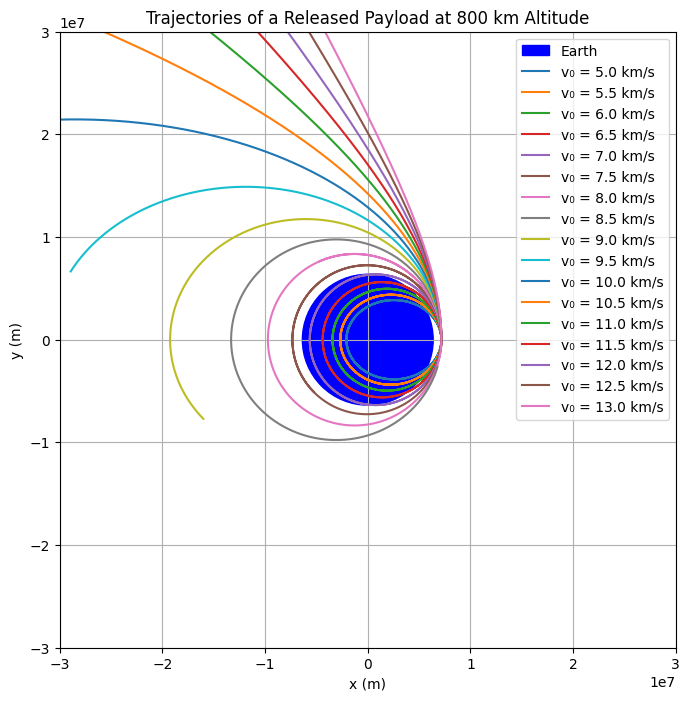
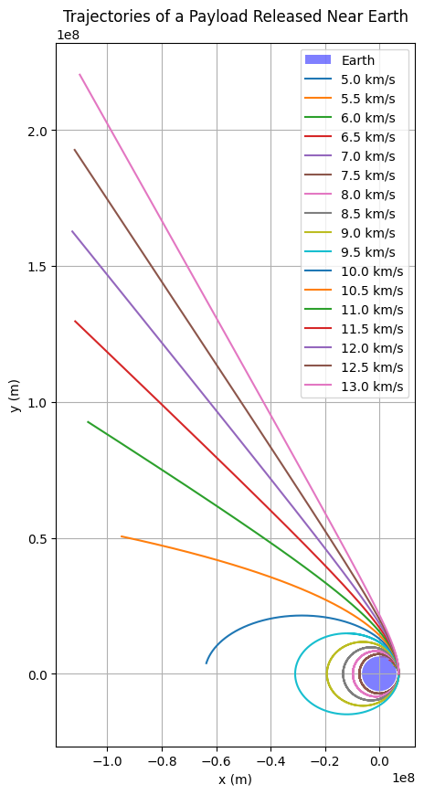

# Problem 3


## Trajectories of a Freely Released Payload Near Earth  

---

## ✅ 1. Motivation  

Understanding the motion of a payload released from a moving spacecraft is crucial in space exploration. The trajectory it follows depends on the initial velocity, position, and the influence of gravity. This scenario is not only a classical mechanics problem but also relevant for applications such as:

- Orbital insertion and satellite deployment  
- Reentry trajectories of spacecraft  
- Escape missions or planetary flybys  

In this report, we analyze and simulate the various types of trajectories—elliptical, parabolic, and hyperbolic—that a payload might follow after release, and visualize their outcomes based on different initial velocities.

---

## ✅ 2. Physical Background  

When a mass is released near a planet, it experiences gravitational acceleration according to Newton's law of universal gravitation:

$$F = \frac{G M m}{r^2}$$  

From this, the gravitational acceleration at distance $r$ is:

$$a = \frac{F}{m} = \frac{G M}{r^2}$$  

The trajectory depends on the total energy of the payload:

- **Elliptical orbit:** $E < 0$  
- **Parabolic escape:** $E = 0$  
- **Hyperbolic escape:** $E > 0$  

Where total energy is given by:

$$E = \frac{1}{2}mv^2 - \frac{G M m}{r}$$  

And $v$ is the velocity at distance $r$.

---

## ✅ 3. Analytical Conditions for Different Trajectories  

At a given altitude, the critical velocities determine what kind of trajectory the payload will follow. For Earth, at radius $r = R + h$, where $h$ is the altitude and $R$ is Earth's radius:

- **Orbital velocity (First cosmic velocity):**  
  $$v_1 = \sqrt{\frac{G M}{r}}$$  

- **Escape velocity (Second cosmic velocity):**  
  $$v_2 = \sqrt{\frac{2 G M}{r}}$$  

- **Velocity to escape Sun from Earth orbit (Third cosmic velocity, approx):**  
  $$v_3 \approx \sqrt{v_2^2 + v_{orbit,sun}^2}$$  

We focus here on the first two, since third cosmic velocity is better suited for interplanetary scale.

---

## ✅ 4. Initial Conditions  

- Gravitational constant: $G = 6.674 \times 10^{-11}\ \text{m}^3/\text{kg/s}^2$  
- Mass of Earth: $M = 5.972 \times 10^{24}\ \text{kg}$  
- Radius of Earth: $R = 6.371 \times 10^6\ \text{m}$  
- Altitude: $h = 800\ \text{km} = 8.0 \times 10^5\ \text{m}$  
- Position: $r = R + h = 7.171 \times 10^6\ \text{m}$  

Now we calculate the two key velocities at this altitude:

- $v_1 = \sqrt{\frac{G M}{r}} \approx 7.45\ \text{km/s}$  
- $v_2 = \sqrt{2} \cdot v_1 \approx 10.54\ \text{km/s}$  

---

## ✅ 5. Simulation of Payload Trajectories  

We simulate trajectories for a payload released at an altitude of 800 km with initial velocities from 5 km/s to 13 km/s, using numerical integration.  

### 🔹 Python Code to Simulate and Plot:

```python
import numpy as np
import matplotlib.pyplot as plt
from scipy.integrate import solve_ivp

# Constants
G = 6.67430e-11  # m^3 kg^-1 s^-2
M = 5.972e24     # kg
R_earth = 6371e3 # m
h = 800e3        # altitude in meters
r0 = R_earth + h # initial distance from center of Earth

# Time span for simulation
t_span = (0, 10000)
t_eval = np.linspace(*t_span, 5000)

# Gravitational acceleration function
def gravity(t, y):
    x, y_pos, vx, vy = y
    r = np.sqrt(x**2 + y_pos**2)
    ax = -G * M * x / r**3
    ay = -G * M * y_pos / r**3
    return [vx, vy, ax, ay]

# Initial position
x0, y0 = r0, 0

# Velocities from 5 to 13 km/s
velocities = np.arange(5e3, 13.5e3, 0.5e3)

# Plot
fig, ax = plt.subplots(figsize=(8, 8))
earth = plt.Circle((0, 0), R_earth, color='blue', label='Earth')
ax.add_patch(earth)

for v0 in velocities:
    y_init = [x0, y0, 0, v0]
    sol = solve_ivp(gravity, t_span, y_init, t_eval=t_eval, rtol=1e-8)
    x_vals, y_vals = sol.y[0], sol.y[1]
    ax.plot(x_vals, y_vals, label=f'v₀ = {v0/1e3:.1f} km/s')

# Plot formatting
ax.set_xlim(-3e7, 3e7)
ax.set_ylim(-3e7, 3e7)
ax.set_aspect('equal')
ax.set_xlabel('x (m)')
ax.set_ylabel('y (m)')
ax.set_title('Trajectories of a Released Payload at 800 km Altitude')
ax.legend()
plt.grid(True)
plt.show()

```


---

## ✅ 6. Numerical Simulation and Visualization

We developed a numerical simulation that calculates the trajectories of a payload released 800 km above the Earth's surface, with varying initial velocities ranging from 5 km/s to 13 km/s.  
The simulation solves the equations of motion under Earth's gravitational influence using time-stepping.

**Parameters:**
- Gravitational constant: $G = 6.674 \times 10^{-11}\ \text{N m}^2/\text{kg}^2$
- Earth's mass: $M = 5.972 \times 10^{24}\ \text{kg}$
- Earth's radius: $R_{\text{Earth}} = 6371\ \text{km}$
- Initial altitude: $800\ \text{km}$
- Initial position: $(R_{\text{Earth}} + 800\ \text{km}, 0)$
- Initial velocities: 5, 5.5, 6, ..., 13 km/s horizontally.

**Python Code:**

```python
import numpy as np
import matplotlib.pyplot as plt

# Constants
G = 6.67430e-11  # gravitational constant
M = 5.972e24     # mass of Earth
R_earth = 6371e3 # radius of Earth in meters

# Initial conditions
altitude = 800e3  # 800 km altitude
initial_pos = np.array([R_earth + altitude, 0])  # starting at (x,0)
initial_velocities = np.arange(5e3, 13.5e3, 0.5e3)  # velocities from 5 to 13 km/s

# Time settings
dt = 1  # time step in seconds
t_max = 30000  # total simulation time

# Create figure
fig, ax = plt.subplots(figsize=(10,10))
theta = np.linspace(0, 2*np.pi, 100)
earth_x = R_earth * np.cos(theta)
earth_y = R_earth * np.sin(theta)
ax.fill(earth_x, earth_y, 'b', alpha=0.5, label='Earth')

# Plot trajectories
for v0 in initial_velocities:
    pos = initial_pos.copy()
    vel = np.array([0, v0])
    x_vals, y_vals = [], []

    for _ in range(int(t_max/dt)):
        r = np.linalg.norm(pos)
        if r < R_earth:
            break  # collision with Earth
        acc = -G * M * pos / r**3
        vel += acc * dt
        pos += vel * dt
        x_vals.append(pos[0])
        y_vals.append(pos[1])
    
    ax.plot(x_vals, y_vals, label=f'{v0/1e3:.1f} km/s')

# Plot settings
ax.set_xlabel('x (m)')
ax.set_ylabel('y (m)')
ax.set_title('Trajectories of a Payload Released Near Earth')
ax.legend()
ax.set_aspect('equal')
ax.grid(True)
plt.show()
```


---

## ✅ 7. Analysis of Trajectory Types

Depending on the initial velocity:
- **Below orbital velocity (~7.9 km/s):** The object falls back to Earth (suborbital flight).
- **At orbital velocity (~7.9 km/s):** A **circular orbit** around Earth is established.
- **Between orbital and escape velocity (~11.2 km/s):** An **elliptical orbit** is created.
- **At escape velocity (~11.2 km/s):** The payload follows a **parabolic trajectory**, escaping Earth's gravity.
- **Above escape velocity:** A **hyperbolic trajectory** results, leading to interplanetary or interstellar travel.

The simulation clearly visualizes these transitions between different types of motion.

---

## ✅ 8. Importance in Space Exploration

Understanding and controlling these trajectories is crucial for:
- **Satellite Deployment:** Achieving stable orbits around Earth.
- **Space Missions:** Sending spacecraft to other planets, requiring precise velocities.
- **Planetary Defense:** Predicting and altering asteroid trajectories.
- **Return Missions:** Planning safe reentry paths for crewed and uncrewed spacecraft.
- **Deep Space Exploration:** Launching probes beyond the Solar System.

Correct trajectory calculations ensure mission success and safety, optimizing fuel use and minimizing risks.

---

## ✅ 9. Conclusion

This study examined the possible trajectories of a payload released near Earth, demonstrating how variations in initial velocity drastically influence the resulting path.  
Using Newton's gravitational law and numerical simulations:
- We derived conditions for suborbital, orbital, escape, and hyperbolic motions.
- The plots confirmed theoretical predictions visually.
- The analysis highlighted the central role of initial velocity and gravitational forces in orbital mechanics.

Such investigations are foundational for space exploration, ensuring the accurate deployment of satellites, interplanetary travel, and beyond.

---

