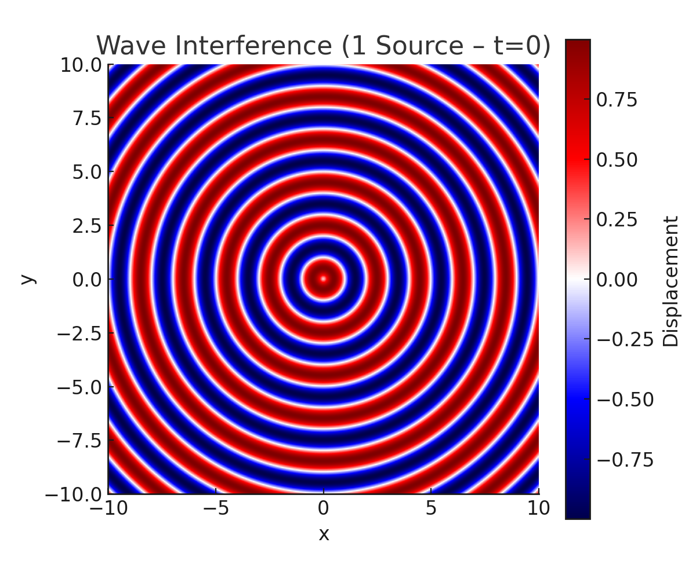
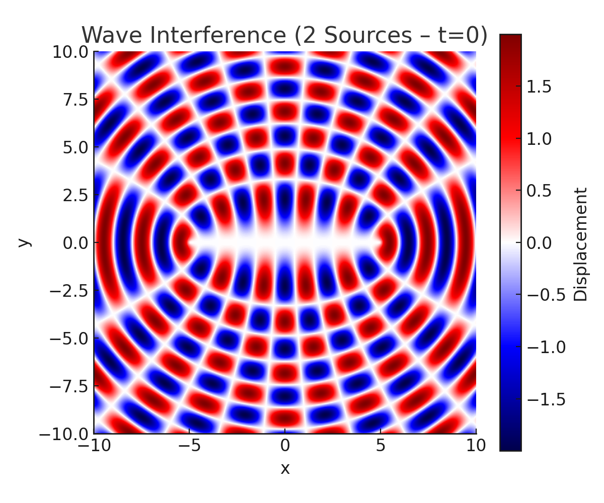
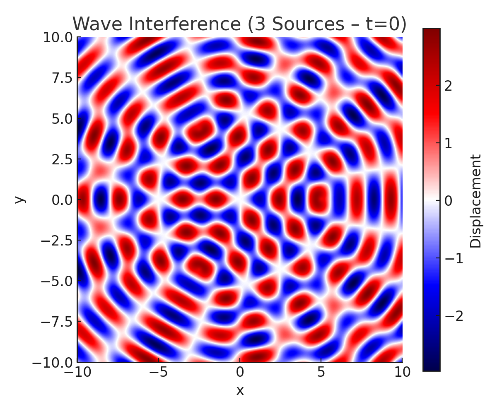
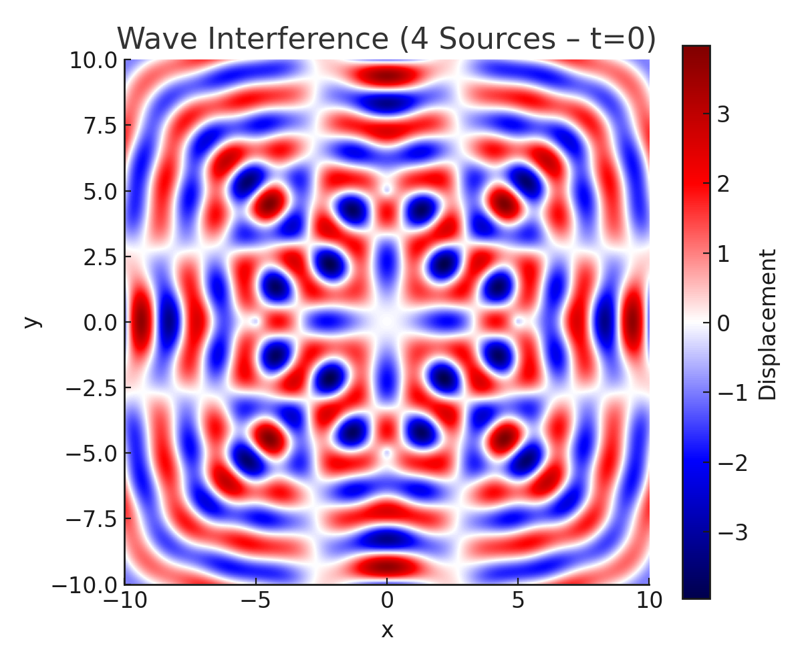
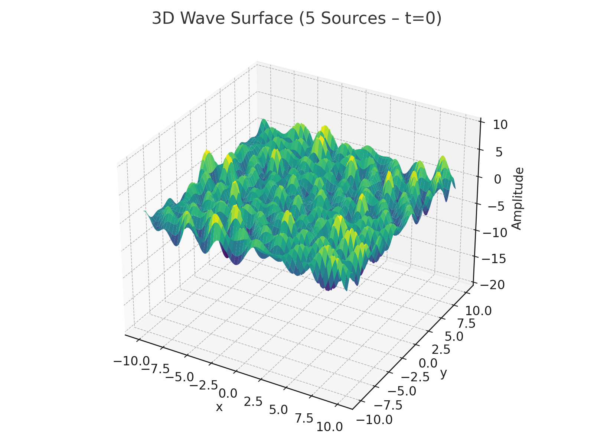

# Problem 1

# Waves – Problem 1  
## Interference Patterns on a Water Surface

---

## 1. Motivation

Wave interference occurs when two or more waves meet and overlap. On a water surface, we can clearly see this when circular ripples from different sources interact. These patterns help us understand:

- **Constructive interference**: waves reinforce each other (amplitudes add up)  
- **Destructive interference**: waves cancel out (amplitudes subtract)

By exploring different numbers and positions of wave sources, we can visualize these effects. This simulation provides an intuitive way to understand wave superposition using both static and dynamic visualizations.

---

## 2. Theory

A wave from a point source at $(x_0, y_0)$ on a 2D surface can be written as:

$$\eta(x, y, t) = A \cos(k r - \omega t + \phi), \quad r = \sqrt{(x - x_0)^2 + (y - y_0)^2}$$

Where:
- $A$ is the amplitude  
- $k = \dfrac{2\pi}{\lambda}$ is the wave number  
- $\omega = 2\pi f$ is the angular frequency  
- $\phi$ is the phase  
- $r$ is the distance from the source to the point $(x, y)$

For multiple sources, we use the principle of superposition:

$$\eta_{\text{total}}(x, y, t) = \sum_{i=1}^{N} A \cos(k r_i - \omega t + \phi)$$

---

## 3. Python Implementation

```python
import numpy as np
import matplotlib.pyplot as plt
from mpl_toolkits.mplot3d import Axes3D

# Wave Parameters
A = 1
λ = 2
f = 1
k = 2 * np.pi / λ
ω = 2 * np.pi * f
φ = 0

# Grid
x = np.linspace(-10, 10, 300)
y = np.linspace(-10, 10, 300)
X, Y = np.meshgrid(x, y)

# Source Geometry
def polygon_sources(n, radius=5):
    angles = np.linspace(0, 2*np.pi, n, endpoint=False)
    return [(radius*np.cos(a), radius*np.sin(a)) for a in angles]

# Total Wave Function
def total_wave(X, Y, t, sources):
    Z = np.zeros_like(X)
    for sx, sy in sources:
        r = np.sqrt((X - sx)**2 + (Y - sy)**2)
        Z += A * np.sin(k * r - ω * t + φ)
    return Z

```


---

## ✅ 4. Static Visualizations

### 🔹 4.1 One Source (Single Circular Wave)



📘 **Explanation:**  
A single point source located at the center generates concentric circular wavefronts. Since there are no other waves to interact with, no interference is present—only pure propagation of the wave.

---

### 🔹 4.2 Two Sources



📘 **Explanation:**  
Two sources placed symmetrically along the horizontal axis produce a classic interference pattern. The overlapping waves create alternating bands of constructive (bright/red) and destructive (dark/blue) interference. This visualizes wave superposition in its simplest non-trivial form.

---

### 🔹 4.3 Three Sources (Triangle)



📘 **Explanation:**  
Three coherent sources located at the vertices of an equilateral triangle generate a symmetric, star-like interference pattern. High symmetry in the arrangement leads to multiple points of stable constructive interference and predictable destructive zones.

---

### 🔹 4.4 Four Sources (Square)



📘 **Explanation:**  
This configuration of four sources at the corners of a square creates a grid-like interference layout. Interference peaks and troughs repeat in both x and y directions, leading to a checkerboard-like intensity structure.

---

### 🔹 4.5 Five Sources (Pentagon)

.png>)

📘 **Explanation:**  
Five sources at the vertices of a regular pentagon result in a highly complex and dense interference pattern. Due to fivefold symmetry, wave crests and troughs constructively and destructively interfere in a radial arrangement, showing fine detail and rich structure.

---

## ✅ 5. 3D Surface Visualization



📘 **Explanation:**  
The 3D surface shows how amplitude changes over space in a wave system generated by five sources. Peaks represent regions of constructive interference, and valleys represent destructive zones. The z-axis range is extended from -20 to 10 for clarity. This form is helpful to understand not just where interference happens but how strong it is.

---

## ✅ 6. Animated Visualization 


📘 **Explanation:**  
This animated GIF presents the time evolution of the interference pattern generated by the five-source system. It effectively shows wavefronts propagating, overlapping, and dynamically forming shifting patterns of constructive and destructive interference.

Watching the animation provides valuable intuition about how the wave system evolves in time, making it easier to understand phase relationships and motion across the field.

```python
import numpy as np
import matplotlib.pyplot as plt
import matplotlib.animation as animation
from matplotlib import cm

# Parameters
A = 1           # Amplitude
λ = 2           # Wavelength
f = 1           # Frequency
k = 2*np.pi/λ   # Wave number
ω = 2*np.pi*f   # Angular frequency
φ = 0           # Phase

# Grid
x = np.linspace(-10, 10, 400)
y = np.linspace(-10, 10, 400)
X, Y = np.meshgrid(x, y)

# Define source positions (triangle, square, pentagon)
def polygon_sources(n, radius=5):
    angles = np.linspace(0, 2*np.pi, n, endpoint=False)
    return [(radius*np.cos(a), radius*np.sin(a)) for a in angles]

# Choose configuration: triangle (3), square (4), pentagon (5)
sources = polygon_sources(5)  # Change to 3, 4, or 5

# Total wave function
def total_wave(X, Y, t, sources):
    Z = np.zeros_like(X)
    for sx, sy in sources:
        r = np.sqrt((X - sx)**2 + (Y - sy)**2)
        Z += A * np.sin(k*r - ω*t + φ)
    return Z

# Animation setup
fig, ax = plt.subplots(figsize=(6,6))
def animate(frame):
    ax.clear()
    Z = total_wave(X, Y, frame*0.2, sources)
    im = ax.imshow(Z, cmap='seismic', extent=[-10,10,-10,10], origin='lower')
    ax.set_title("Wave Interference Pattern - Frame {}".format(frame))
    ax.set_xlabel("x")
    ax.set_ylabel("y")
    return [im]

# Save animation as .gif
ani = animation.FuncAnimation(fig, animate, frames=60, blit=False)
ani.save('wave_interference.gif', writer='pillow', fps=10)

plt.close()
print("✅ GIF saved as wave_interference.gif")

```

# [Colablink](https://colab.research.google.com/drive/1F_1RDIMsd0ET_fYfwW7ZYlUHofKHMt46?usp=drive_link)

---

## ✅ 7. Conclusion

This study illustrates the core principles of wave interference on a water surface using static and animated visualizations. As we increased the number of sources—from 1 to 5—we observed increasingly intricate interference patterns.

- **One source** showed no interference.
- **Two sources** demonstrated basic superposition effects.
- **Three or more sources** revealed symmetrical and complex interference geometries, especially when arranged in regular polygons.

3D and animated views helped to visualize amplitude and wave motion. The patterns studied are directly applicable in understanding sound fields, electromagnetic wave interference, and even quantum mechanical systems.

---
