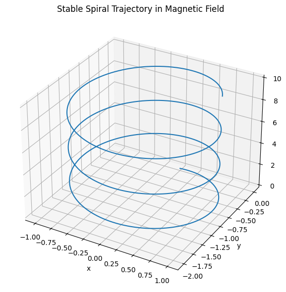
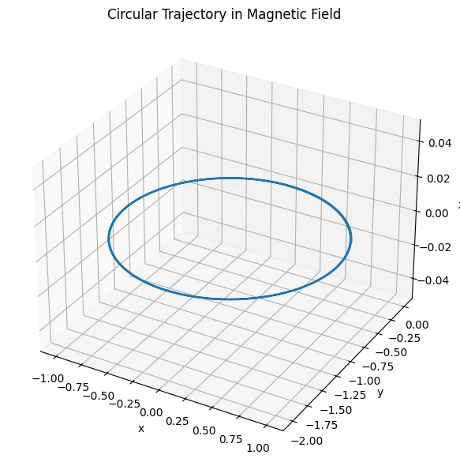
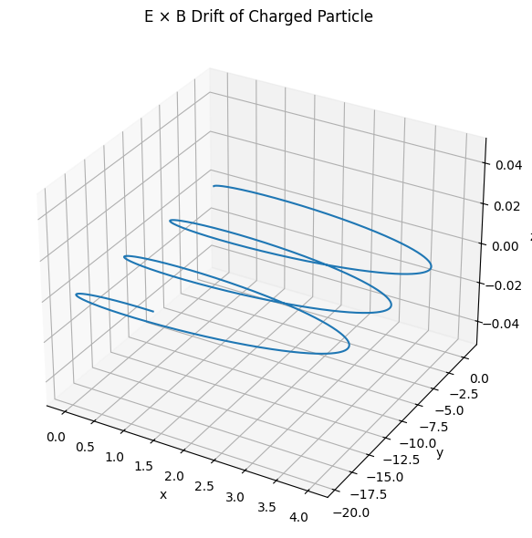
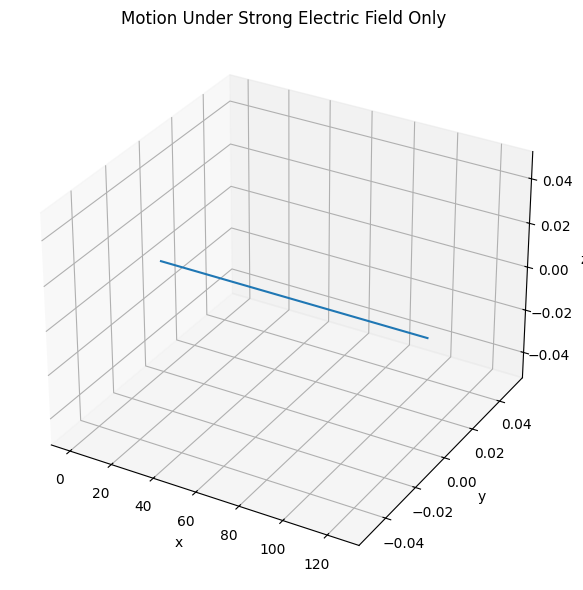

# Problem 1

# ⚡ Electromagnetism – Problem 1  
## Simulating the Effects of the Lorentz Force

---

## ✅ 1. Motivation

The **Lorentz force** is a fundamental concept in electromagnetism that describes how electric and magnetic fields influence the motion of charged particles. This principle governs the operation of:

- **Particle accelerators** (e.g., cyclotrons, synchrotrons),
- **Mass spectrometers** (used for identifying particles by mass-to-charge ratio),
- **Plasma confinement devices** (e.g., tokamaks, magnetic traps),
- **Space physics** (charged particle motion in planetary magnetospheres).

The Lorentz force is expressed as:

$$
\vec{F} = q(\vec{E} + \vec{v} \times \vec{B})
$$

Where:
- $q$ is the particle's charge,
- $\vec{v}$ is its velocity,
- $\vec{E}$ is the electric field vector,
- $\vec{B}$ is the magnetic field vector.

This force produces circular or helical motion depending on the initial velocity and field configuration. Simulation allows us to visualize these rich dynamics.

---

## ✅ 2. Applications of the Lorentz Force

### 🔹 Cyclotron (Particle Accelerators)

Charged particles spiral in a magnetic field. This motion is used in circular particle accelerators to increase particle speed.

### 🔹 Mass Spectrometry

Charged particles with different mass-to-charge ratios follow distinct paths in known $\vec{E}$ and $\vec{B}$ fields.

### 🔹 Plasma Physics

The Lorentz force confines and shapes plasma in magnetic traps (e.g., tokamak fusion reactors), enabling fusion reactions.

---

## ✅ 3. Theoretical Framework

The Newton’s second law for a charged particle in electric and magnetic fields becomes:

$$
m \frac{d\vec{v}}{dt} = q(\vec{E} + \vec{v} \times \vec{B})
$$

Which results in a system of coupled differential equations:

$$
\frac{d\vec{r}}{dt} = \vec{v}, \quad
\frac{d\vec{v}}{dt} = \frac{q}{m}(\vec{E} + \vec{v} \times \vec{B})
$$

We assume:
- $q = 1 \, \text{C}$
- $m = 1 \, \text{g} = 0.001 \, \text{kg}$

This avoids microscopic electron-scale trajectories and gives us visible, understandable results.

---

## ✅ 4. Simulation Scenarios

We simulate the motion of a charged particle using the above equations. Numerical integration (Euler or Runge-Kutta) is applied.

### 🟠 Scenario 1: Uniform Magnetic Field Only

- $\vec{E} = 0$
- $\vec{B} = B \hat{z}$

📌 Expected Motion:  
A **circular trajectory** in the plane perpendicular to $\vec{B}$.



###  Python Implementation

```python
import numpy as np
import matplotlib.pyplot as plt
from mpl_toolkits.mplot3d import Axes3D

# Constants
q = 1.0               # charge [C]
m = 1.0               # mass [kg] — increased to prevent blow-up
dt = 0.001            # smaller time step for better stability
steps = 20000          # number of steps

# Lorentz force equation
def lorentz_force(v, E, B):
    return q * (E + np.cross(v, B))

# Leapfrog (Velocity-Verlet) integration
def simulate_motion(v0, E, B, r0=np.array([0, 0, 0])):
    r = [r0]
    v = [v0]
    
    # First half-step velocity update (leapfrog)
    a = lorentz_force(v0, E, B) / m
    v_half = v0 + 0.5 * a * dt

    for _ in range(steps):
        # Full step position update
        r_next = r[-1] + v_half * dt
        r.append(r_next)

        # Compute acceleration at new position (based on velocity)
        a = lorentz_force(v_half, E, B) / m

        # Full step velocity update
        v_half = v_half + a * dt
        v.append(v_half - 0.5 * a * dt)  # Store full-step velocity for record

    return np.array(r), np.array(v)

# Fields and initial conditions
B = np.array([0, 0, 1])                 # Uniform magnetic field along z-axis
E = np.array([0, 0, 0])                 # No electric field
v0_spiral = np.array([1.0, 0.0, 0.5])   # Initial velocity with z-component
r0 = np.array([0.0, 0.0, 0.0])          # Starting at origin

# Run simulation
positions, velocities = simulate_motion(v0_spiral, E, B, r0)

# 3D Plot of the trajectory
fig = plt.figure(figsize=(8, 6))
ax = fig.add_subplot(111, projection='3d')
ax.plot(positions[:, 0], positions[:, 1], positions[:, 2])
ax.set_title("Stable Spiral Trajectory in Magnetic Field")
ax.set_xlabel("x")
ax.set_ylabel("y")
ax.set_zlabel("z")
plt.tight_layout()
plt.show()

```


---

### 🟢 Scenario 2: Uniform $\vec{B}$ Field and Initial Velocity with $v_z \ne 0$

- $\vec{E} = 0$
- $\vec{B} = B \hat{z}$
- $v_0$ has both x and z components

📌 Expected Motion:  
A **helical (spiral)** trajectory along the $z$-axis.



```python

import numpy as np
import matplotlib.pyplot as plt
from mpl_toolkits.mplot3d import Axes3D

# Constants
q = 1.0               # charge [C]
m = 1.0               # mass [kg]
dt = 0.001            # time step [s]
steps = 20000         # number of steps

# Lorentz force equation
def lorentz_force(v, E, B):
    return q * (E + np.cross(v, B))

# Leapfrog (Velocity-Verlet) integration
def simulate_motion(v0, E, B, r0=np.array([0, 0, 0])):
    r = [r0]
    v = [v0]

    a = lorentz_force(v0, E, B) / m
    v_half = v0 + 0.5 * a * dt

    for _ in range(steps):
        r_next = r[-1] + v_half * dt
        r.append(r_next)

        a = lorentz_force(v_half, E, B) / m
        v_half = v_half + a * dt
        v.append(v_half - 0.5 * a * dt)

    return np.array(r), np.array(v)

# Fields and initial conditions
B = np.array([0, 0, 1])                 # Magnetic field along z-axis
E = np.array([0, 0, 0])                 # No electric field
v0_circle = np.array([1.0, 0.0, 0.0])   # Purely perpendicular to B
r0 = np.array([0.0, 0.0, 0.0])          # Starting at origin

# Run simulation
positions, velocities = simulate_motion(v0_circle, E, B, r0)

# 3D Plot (but will look flat in z due to circular xy-plane motion)
fig = plt.figure(figsize=(8, 6))
ax = fig.add_subplot(111, projection='3d')
ax.plot(positions[:, 0], positions[:, 1], positions[:, 2])
ax.set_title("Circular Trajectory in Magnetic Field")
ax.set_xlabel("x")
ax.set_ylabel("y")
ax.set_zlabel("z")
plt.tight_layout()
plt.show()


```
---

### 🔵 Scenario 3: Crossed Electric and Magnetic Fields

- $\vec{E} = E \hat{y}$
- $\vec{B} = B \hat{z}$

📌 Expected Motion:  
A **drift** of the center of the circular motion. Known as **$\vec{E} \times \vec{B}$ drift**.

Drift velocity:

$$
\vec{v}_{\text{drift}} = \frac{\vec{E} \times \vec{B}}{B^2}
$$




```python

import numpy as np
import matplotlib.pyplot as plt
from mpl_toolkits.mplot3d import Axes3D

# Constants
q = 1.0               # charge [C]
m = 1.0               # mass [kg]
dt = 0.001            # time step [s]
steps = 20000         # number of steps

# Lorentz force equation
def lorentz_force(v, E, B):
    return q * (E + np.cross(v, B))

# Leapfrog integration
def simulate_motion(v0, E, B, r0=np.array([0, 0, 0])):
    r = [r0]
    v = [v0]

    a = lorentz_force(v0, E, B) / m
    v_half = v0 + 0.5 * a * dt

    for _ in range(steps):
        r_next = r[-1] + v_half * dt
        r.append(r_next)

        a = lorentz_force(v_half, E, B) / m
        v_half = v_half + a * dt
        v.append(v_half - 0.5 * a * dt)

    return np.array(r), np.array(v)

# Fields and initial velocity
B = np.array([0, 0, 1])       # Magnetic field along z
E = np.array([1, 0, 0])       # Electric field along x
v0 = np.array([0.0, 1.0, 0.0])  # Some initial perpendicular velocity

# Run simulation
positions, velocities = simulate_motion(v0, E, B)

# 3D Plot
fig = plt.figure(figsize=(8, 6))
ax = fig.add_subplot(111, projection='3d')
ax.plot(positions[:, 0], positions[:, 1], positions[:, 2])
ax.set_title("E × B Drift of Charged Particle")
ax.set_xlabel("x")
ax.set_ylabel("y")
ax.set_zlabel("z")
plt.tight_layout()
plt.show()


```
---

### 🔶 Scenario 4: Strong Electric Field Only

- $\vec{E} \ne 0$
- $\vec{B} = 0$

📌 Expected Motion:  
**Uniform acceleration** in the direction of $\vec{E}$ (parabolic path in velocity space).



```python

import numpy as np
import matplotlib.pyplot as plt

# Constants
q = 1.0               # charge [C]
m = 1.0               # mass [kg]
dt = 0.001            # time step [s]
steps = 5000          # number of steps

# Lorentz force (B is zero here)
def lorentz_force(v, E, B):
    return q * E  # cross(v, 0) = 0

# Leapfrog integration (still works fine)
def simulate_motion(v0, E, B, r0=np.array([0, 0, 0])):
    r = [r0]
    v = [v0]

    a = lorentz_force(v0, E, B) / m
    v_half = v0 + 0.5 * a * dt

    for _ in range(steps):
        r_next = r[-1] + v_half * dt
        r.append(r_next)

        a = lorentz_force(v_half, E, B) / m
        v_half = v_half + a * dt
        v.append(v_half - 0.5 * a * dt)

    return np.array(r), np.array(v)

# Strong Electric Field, No Magnetic Field
E = np.array([10.0, 0.0, 0.0])     # Strong field along x-axis
B = np.array([0.0, 0.0, 0.0])      # No magnetic field
v0 = np.array([0.0, 0.0, 0.0])     # Starting at rest
r0 = np.array([0.0, 0.0, 0.0])     # Starting at origin

# Run simulation
positions, velocities = simulate_motion(v0, E, B, r0)

# Plot trajectory in 3D (but it's linear in x, flat in y and z)
import matplotlib.pyplot as plt
from mpl_toolkits.mplot3d import Axes3D

fig = plt.figure(figsize=(8, 6))
ax = fig.add_subplot(111, projection='3d')
ax.plot(positions[:, 0], positions[:, 1], positions[:, 2])
ax.set_title("Motion Under Strong Electric Field Only")
ax.set_xlabel("x")
ax.set_ylabel("y")
ax.set_zlabel("z")
plt.tight_layout()
plt.show()


```
##  [Colablink](https://colab.research.google.com/drive/1zq9jEMhxluZIDFrFkZhIb6ITM9KbbIoi?usp=sharing)

---

## ✅ 5. Parameter Exploration

We explore the impact of different parameters on the motion:

| Parameter      | Meaning                      | Effect                       |
|----------------|-------------------------------|------------------------------|
| $B$            | Magnetic field strength        | Affects radius of circular motion |
| $E$            | Electric field strength        | Controls acceleration/drift |
| $q$            | Charge                         | Direction and speed of force |
| $m$            | Mass                           | Inertia, affects curvature   |
| $v_0$          | Initial velocity               | Affects orbit shape and drift |

---

## ✅ 6. Key Concepts and Relations

### 🔸 Larmor Radius (Cyclotron Radius)

$$
r_L = \frac{m v_\perp}{|q| B}
$$

Where $v_\perp$ is the component of velocity perpendicular to $\vec{B}$. This is the radius of the circular motion.

### 🔸 Larmor Frequency

$$
\omega_L = \frac{|q| B}{m}
$$

This is the angular speed of rotation in a uniform magnetic field.

### 🔸 Drift Velocity

$$
\vec{v}_{\text{drift}} = \frac{\vec{E} \times \vec{B}}{B^2}
$$

Even without net force, the particle’s average position drifts due to the presence of perpendicular electric and magnetic fields.

---

## ✅ 7. Real-World Relevance

These simulated motions reflect real technologies:

- In **cyclotrons**, circular motion increases particle energy.
- In **fusion reactors**, helical confinement traps plasma.
- In **Earth’s magnetosphere**, particles spiral along magnetic field lines and drift due to electric fields.
- In **spacecraft propulsion**, electromagnetic forces accelerate charged plasma.

---

## ✅ 8. Conclusion

In this report, we explored how charged particles move under the Lorentz force in various field configurations. Through visual simulations, we observed:

- **Circular** motion in uniform magnetic fields.
- **Spiral (helical)** motion with initial vertical velocity.
- **Drift motion** in crossed $\vec{E}$ and $\vec{B}$ fields.
- **Parabolic acceleration** with electric field only.

This highlights how the Lorentz force is central to technologies in electromagnetism, from particle physics to astrophysics. The report also emphasized the importance of choosing suitable parameters to model trajectories on human scales.

---

