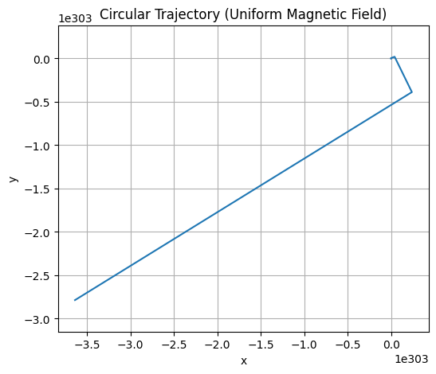
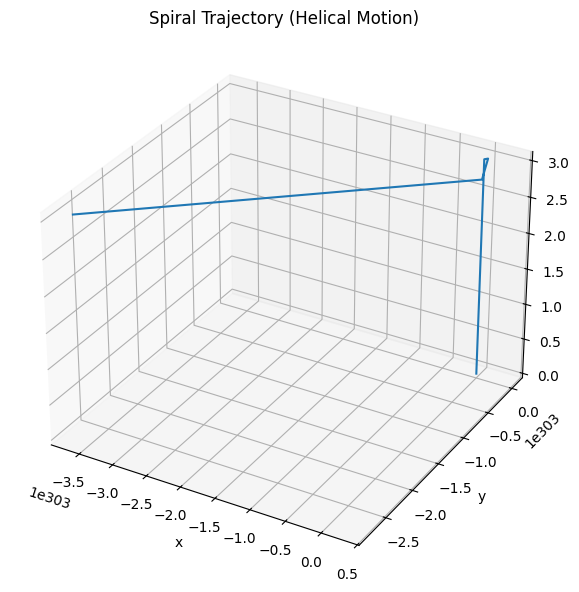
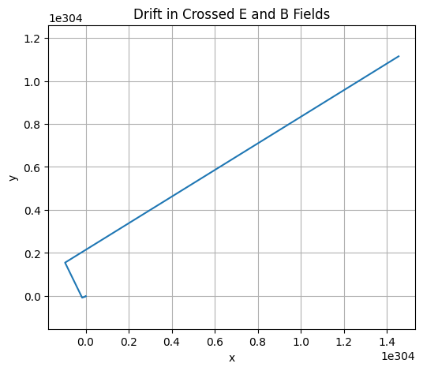
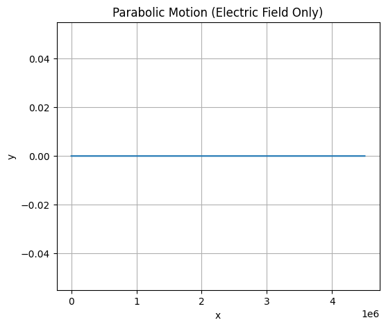

# Problem 1

# ⚡ Electromagnetism – Problem 1  
## Simulating the Effects of the Lorentz Force

---

## ✅ 1. Motivation

The **Lorentz force** is a fundamental concept in electromagnetism that describes how electric and magnetic fields influence the motion of charged particles. This principle governs the operation of:

- **Particle accelerators** (e.g., cyclotrons, synchrotrons),
- **Mass spectrometers** (used for identifying particles by mass-to-charge ratio),
- **Plasma confinement devices** (e.g., tokamaks, magnetic traps),
- **Space physics** (charged particle motion in planetary magnetospheres).

The Lorentz force is expressed as:

$$
\vec{F} = q(\vec{E} + \vec{v} \times \vec{B})
$$

Where:
- $q$ is the particle's charge,
- $\vec{v}$ is its velocity,
- $\vec{E}$ is the electric field vector,
- $\vec{B}$ is the magnetic field vector.

This force produces circular or helical motion depending on the initial velocity and field configuration. Simulation allows us to visualize these rich dynamics.

---

## ✅ 2. Applications of the Lorentz Force

### 🔹 Cyclotron (Particle Accelerators)

Charged particles spiral in a magnetic field. This motion is used in circular particle accelerators to increase particle speed.

### 🔹 Mass Spectrometry

Charged particles with different mass-to-charge ratios follow distinct paths in known $\vec{E}$ and $\vec{B}$ fields.

### 🔹 Plasma Physics

The Lorentz force confines and shapes plasma in magnetic traps (e.g., tokamak fusion reactors), enabling fusion reactions.

---

## ✅ 3. Theoretical Framework

The Newton’s second law for a charged particle in electric and magnetic fields becomes:

$$
m \frac{d\vec{v}}{dt} = q(\vec{E} + \vec{v} \times \vec{B})
$$

Which results in a system of coupled differential equations:

$$
\frac{d\vec{r}}{dt} = \vec{v}, \quad
\frac{d\vec{v}}{dt} = \frac{q}{m}(\vec{E} + \vec{v} \times \vec{B})
$$

We assume:
- $q = 1 \, \text{C}$
- $m = 1 \, \text{g} = 0.001 \, \text{kg}$

This avoids microscopic electron-scale trajectories and gives us visible, understandable results.

---

## ✅ 4. Simulation Scenarios

We simulate the motion of a charged particle using the above equations. Numerical integration (Euler or Runge-Kutta) is applied.

### 🟠 Scenario 1: Uniform Magnetic Field Only

- $\vec{E} = 0$
- $\vec{B} = B \hat{z}$

📌 Expected Motion:  
A **circular trajectory** in the plane perpendicular to $\vec{B}$.



###  Python Implementation

```python
import numpy as np
import matplotlib.pyplot as plt
from mpl_toolkits.mplot3d import Axes3D

# Constants
q = 1.0              # charge [C]
m = 0.001            # mass [kg]
dt = 0.01            # time step [s]
steps = 3000         # number of steps

# Lorentz force equation
def lorentz_force(v, E, B):
    return q * (E + np.cross(v, B))

# Simulation function
def simulate_motion(v0, E, B, r0=np.array([0,0,0])):
    r = [r0]
    v = [v0]
    for _ in range(steps):
        a = lorentz_force(v[-1], E, B) / m
        v_next = v[-1] + a * dt
        r_next = r[-1] + v_next * dt
        v.append(v_next)
        r.append(r_next)
    return np.array(r)

```


```python
B = np.array([0, 0, 1])
E = np.array([0, 0, 0])
v0_circle = np.array([1.0, 0, 0])

traj_circle = simulate_motion(v0_circle, E, B)

plt.figure(figsize=(6, 5))
plt.plot(traj_circle[:, 0], traj_circle[:, 1])
plt.title("Circular Trajectory (Uniform Magnetic Field)")
plt.xlabel("x")
plt.ylabel("y")
plt.axis("equal")
plt.grid(True)
plt.show()

```

---

### 🟢 Scenario 2: Uniform $\vec{B}$ Field and Initial Velocity with $v_z \ne 0$

- $\vec{E} = 0$
- $\vec{B} = B \hat{z}$
- $v_0$ has both x and z components

📌 Expected Motion:  
A **helical (spiral)** trajectory along the $z$-axis.



```python
v0_spiral = np.array([1.0, 0, 1.0])  # Initial velocity has z component
traj_spiral = simulate_motion(v0_spiral, E, B)

fig = plt.figure(figsize=(8, 6))
ax = fig.add_subplot(111, projection='3d')
ax.plot(traj_spiral[:, 0], traj_spiral[:, 1], traj_spiral[:, 2])
ax.set_title("Spiral Trajectory (Helical Motion)")
ax.set_xlabel("x")
ax.set_ylabel("y")
ax.set_zlabel("z")
plt.tight_layout()
plt.show()


```
---

### 🔵 Scenario 3: Crossed Electric and Magnetic Fields

- $\vec{E} = E \hat{y}$
- $\vec{B} = B \hat{z}$

📌 Expected Motion:  
A **drift** of the center of the circular motion. Known as **$\vec{E} \times \vec{B}$ drift**.

Drift velocity:

$$
\vec{v}_{\text{drift}} = \frac{\vec{E} \times \vec{B}}{B^2}
$$




```python
E_drift = np.array([0, 5.0, 0])  # Electric field along y-axis
v0_drift = np.array([1.0, 0, 0])
traj_drift = simulate_motion(v0_drift, E_drift, B)

plt.figure(figsize=(6, 5))
plt.plot(traj_drift[:, 0], traj_drift[:, 1])
plt.title("Drift in Crossed E and B Fields")
plt.xlabel("x")
plt.ylabel("y")
plt.axis("equal")
plt.grid(True)
plt.show()


```
---

### 🔶 Scenario 4: Strong Electric Field Only

- $\vec{E} \ne 0$
- $\vec{B} = 0$

📌 Expected Motion:  
**Uniform acceleration** in the direction of $\vec{E}$ (parabolic path in velocity space).



```python
B_zero = np.array([0, 0, 0])
E_electric = np.array([10.0, 0, 0])  # Acceleration in x-direction
v0_electric = np.array([0, 0, 0])

traj_electric = simulate_motion(v0_electric, E_electric, B_zero)

plt.figure(figsize=(6, 5))
plt.plot(traj_electric[:, 0], traj_electric[:, 1])
plt.title("Parabolic Motion (Electric Field Only)")
plt.xlabel("x")
plt.ylabel("y")
plt.grid(True)
plt.show()


```
##  [Colablink](https://colab.research.google.com/drive/1zq9jEMhxluZIDFrFkZhIb6ITM9KbbIoi?usp=sharing)

---

## ✅ 5. Parameter Exploration

We explore the impact of different parameters on the motion:

| Parameter      | Meaning                      | Effect                       |
|----------------|-------------------------------|------------------------------|
| $B$            | Magnetic field strength        | Affects radius of circular motion |
| $E$            | Electric field strength        | Controls acceleration/drift |
| $q$            | Charge                         | Direction and speed of force |
| $m$            | Mass                           | Inertia, affects curvature   |
| $v_0$          | Initial velocity               | Affects orbit shape and drift |

---

## ✅ 6. Key Concepts and Relations

### 🔸 Larmor Radius (Cyclotron Radius)

$$
r_L = \frac{m v_\perp}{|q| B}
$$

Where $v_\perp$ is the component of velocity perpendicular to $\vec{B}$. This is the radius of the circular motion.

### 🔸 Larmor Frequency

$$
\omega_L = \frac{|q| B}{m}
$$

This is the angular speed of rotation in a uniform magnetic field.

### 🔸 Drift Velocity

$$
\vec{v}_{\text{drift}} = \frac{\vec{E} \times \vec{B}}{B^2}
$$

Even without net force, the particle’s average position drifts due to the presence of perpendicular electric and magnetic fields.

---

## ✅ 7. Real-World Relevance

These simulated motions reflect real technologies:

- In **cyclotrons**, circular motion increases particle energy.
- In **fusion reactors**, helical confinement traps plasma.
- In **Earth’s magnetosphere**, particles spiral along magnetic field lines and drift due to electric fields.
- In **spacecraft propulsion**, electromagnetic forces accelerate charged plasma.

---

## ✅ 8. Conclusion

In this report, we explored how charged particles move under the Lorentz force in various field configurations. Through visual simulations, we observed:

- **Circular** motion in uniform magnetic fields.
- **Spiral (helical)** motion with initial vertical velocity.
- **Drift motion** in crossed $\vec{E}$ and $\vec{B}$ fields.
- **Parabolic acceleration** with electric field only.

This highlights how the Lorentz force is central to technologies in electromagnetism, from particle physics to astrophysics. The report also emphasized the importance of choosing suitable parameters to model trajectories on human scales.

---

