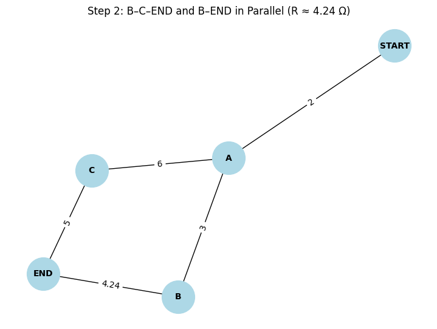

# Problem 1

# ⚡ Circuits Problem 1  
## Equivalent Resistance Using Graph Theory  

---

## ✅ 1. Motivation  

Calculating equivalent resistance is a key task in circuit analysis. Traditionally, this involves applying **series and parallel rules**, but for **complex resistor networks**, these manual methods become inefficient and error-prone.

Graph theory provides a powerful alternative. By modeling the circuit as a **weighted graph**:

- Nodes represent junctions,
- Edges represent resistors (weights = resistance),
- The task becomes a problem of graph simplification.

This method allows for **algorithmic**, repeatable, and programmable solutions — which are especially useful in circuit simulation software.

---

## ✅ 2. Problem Setup  

We consider a circuit modeled as a graph with:

- Nodes representing **junctions**,
- Edges representing **resistors** (with resistance values as weights),
- One **START** node and one **END** node.

The goal is to find the **equivalent resistance** between START and END by simplifying the graph using algorithmic steps based on electrical principles.

---

## ✅ 3. Theoretical Concepts  

### 🔹 Ohm’s Law  
$$V = IR$$

### 🔹 Series Resistance  
If resistors $R_1$ and $R_2$ are in **series**: 

$$R_{\text{eq}} = R_1 + R_2$$

### 🔹 Parallel Resistance  
If resistors $R_1$ and $R_2$ are in **parallel**: 

$$\frac{1}{R_{\text{eq}}} = \frac{1}{R_1} + \frac{1}{R_2}$$

---

## ✅ 4. Graph-Based Strategy  

We represent the circuit as a **graph**:
- Vertices = junctions
- Edges = resistors with weights
- Start and end nodes are marked

The simplification proceeds by:
- Identifying nodes with **degree = 2** (series),
- Identifying **multiple edges** between the same nodes (parallel),
- Iteratively applying reduction rules until a single edge remains.

---

## ✅ 5. Algorithm Overview  

**Step-by-step simplification algorithm:**

1. Find nodes with degree 2 (excluding START and END).
2. Apply **series rule** to combine two adjacent resistors.
3. Find **multiple edges** between two nodes.
4. Apply **parallel rule** to combine them.
5. Repeat steps until only one edge connects START to END.

---

## ✅ 6. Example: Complex Circuit

## 🔹 Step-by-Step Simplification

### ✅ Step 1: Initial Circuit

- START–A: 2 Ω  
- A–B: 3 Ω  
- A–C: 6 Ω  
- B–C: 4 Ω  
- C–END: 5 Ω  
- B–END: 8 Ω  

---

### ✅ Step 2: Combine B–C–END and B–END in Parallel

- B–C = 4 Ω, C–END = 5 Ω → total series: 4 + 5 = **9 Ω**
- B–END = 8 Ω

Combine in parallel:

$$
R_{B-END} = \left(\frac{1}{8} + \frac{1}{9}\right)^{-1} = \frac{72}{17} ≈ 4.24\ \Omega
$$

---

### ✅ Step 3: Combine A–B–END as Series

- A–B = 3 Ω  
- B–END (parallel result) = 4.24 Ω  

Combined:

$$
R_{A–END}^{(1)} = 3 + 4.24 = 7.24\ \Omega
$$

- A–C = 6 Ω  
- C–END = 5 Ω → A–C–END = 11 Ω

---

### ✅ Step 4: Final Parallel Between A–B–END and A–C–END

Parallel of 7.24 Ω and 11 Ω:

$$
R_{\text{A–END}} = \left(\frac{1}{7.24} + \frac{1}{11}\right)^{-1} = \frac{79.64}{18.24} ≈ 4.37\ \Omega
$$

---

### ✅ Final Equivalent Resistance from START

$$
R_{\text{eq}} = R_{\text{START–A}} + R_{\text{A–END}} = 2 + 4.37 = \boxed{6.37\ \Omega}
$$

---

## ✅ Summary

- The final equivalent resistance of the circuit is **6.37 Ω**
- Graph theory allows us to visualize and simplify even complex electrical circuits
- This method can be extended to automated analysis in circuit simulation tools

[Colablink](https://colab.research.google.com/drive/1Gnqf6nJ7SUzUnyfO8ePysKOdNfTIPay3?usp=sharing)
---

## ✅ 7. Analysis and Efficiency  

- Graph reduction steps are efficient and can be automated.
- Works for any **nested** configuration of resistors.
- Algorithm scales well for larger, complex networks.
- Complexity: approximately 
$$\mathcal{O}(n \log n)$$ 
with efficient detection of patterns.

---

## ✅ 8. Conclusion  

This graph-based method of simplifying resistor networks:

- Provides a **structured and scalable** solution,
- Can be implemented in code for use in **circuit simulators**,
- Highlights the deep connection between **physics** and **graph theory**.

It is especially valuable in modern contexts such as:
- PCB design tools,
- Educational simulators,
- Automated testing and optimization.

📌 This approach can be extended to capacitors, AC impedance networks, or even mesh current/loop analysis for complex AC circuits.

---

