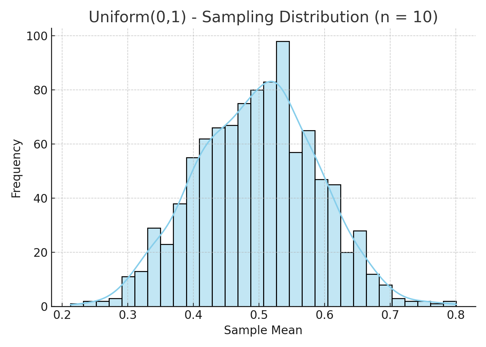
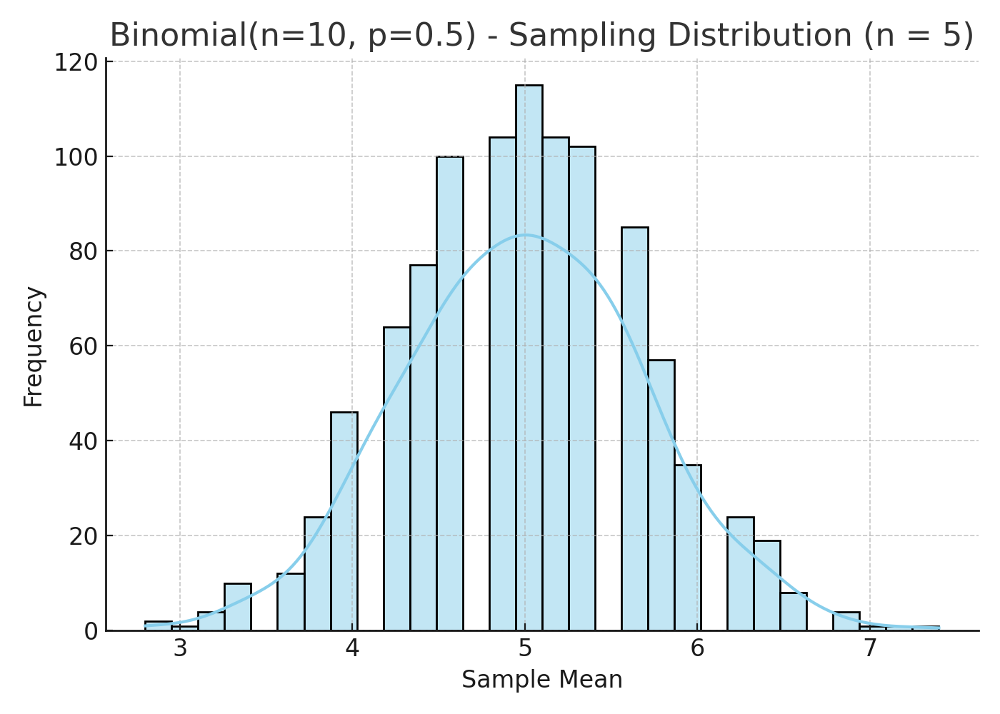

# Problem 1

#  Statistics Problem 1
## Exploring the Central Limit Theorem (CLT) Through Simulations

---

## ✅ 1. Motivation

The **Central Limit Theorem (CLT)** is one of the most important results in probability and statistics. It states:

> Given a population with any distribution (with finite mean $\mu$ and variance $\sigma^2$), the **sampling distribution of the sample mean** approaches a **normal distribution** as the **sample size** increases.

CLT has powerful implications:
- It justifies using the **normal distribution** in inference,
- Enables **confidence intervals** and **hypothesis testing**,
- Supports statistical modeling across various disciplines.

This report demonstrates the CLT via **simulations** from different types of populations.

---

## ✅ 2. Key Definitions

- **Population**: The entire set of data values (e.g., all possible outcomes).
- **Sample**: A subset taken from the population.
- **Sample mean ($\bar{x}$)**: The average value of a sample.
- **Sampling distribution**: The distribution of a statistic (like $\bar{x}$) over many samples.
- **CLT**: As sample size $n \to \infty$, the distribution of $\bar{x}$ approaches normality.

---

## ✅ 3. Simulation Plan

For each population distribution:
1. Generate a **large population** (e.g., 100,000 values).
2. Select **sample sizes** $n = 5,\ 10,\ 30,\ 50$.
3. Draw **repeated random samples** from the population.
4. Compute **sample means** for each iteration.
5. Plot histograms to observe convergence toward a normal shape.

Distributions tested:
- Uniform $(0, 1)$
- Exponential $(\lambda=1)$
- Binomial $(n=10,\ p=0.5)$

---

## ✅ 4. Population Distribution: Uniform(0,1)

### 🎯 Description:
- Flat distribution from 0 to 1.
- Mean: $\mu = 0.5$
- Variance: $\sigma^2 = \frac{1}{12}$

🧠 **Observation**:  
As $n$ increases, histograms become more **bell-shaped**, approximating a normal distribution.

---

## ✅ 5. Population Distribution: Exponential(λ=1)

### 🎯 Description:
- Skewed distribution, mean = 1
- Heavy tail

🧠 **Observation**:  
Convergence is slower due to **high skewness**, but normality is still visible as $n$ grows.

---

## ✅ 6. Population Distribution: Binomial(n=10, p=0.5)

### 🎯 Description:
- Discrete, symmetric shape (similar to normal)
- Mean = $np = 5$

🧠 **Observation**:  
Faster convergence due to population already being **close to normal**.

# [Colablink](https://colab.research.google.com/drive/1XWs5uAljtzlrtBVYSJiZqSI1UhofElnu?usp=sharing)

---

## ✅ 7. Parameter Exploration

### 🔍 Influence of:
- **Sample size ($n$)**: Larger $n$ = better approximation to normal
- **Population shape**: More skewed → slower convergence
- **Variance**: Affects spread (standard error $\propto \frac{\sigma}{\sqrt{n}}$)

---

## ✅ 8. Real-World Applications of CLT

- **Estimating population parameters** (e.g., average income, exam scores)
- **Manufacturing**: Sample testing and quality control
- **Finance**: Risk estimation using historical return sampling
- **Epidemiology**: Predicting disease metrics using population sampling

CLT enables use of **normal-based confidence intervals and p-values** in all these fields.

---

## ✅ 9. Conclusion

The Central Limit Theorem holds for all tested distributions:

- ✅ Even when populations are **non-normal** or **skewed**
- ✅ Larger samples produce **normal-like** sampling distributions
- ✅ Convergence is faster when population is less skewed

CLT allows us to use powerful statistical tools regardless of the underlying population.

---

