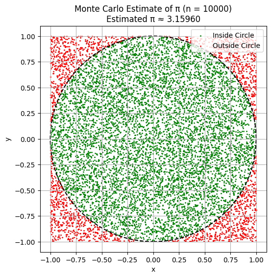
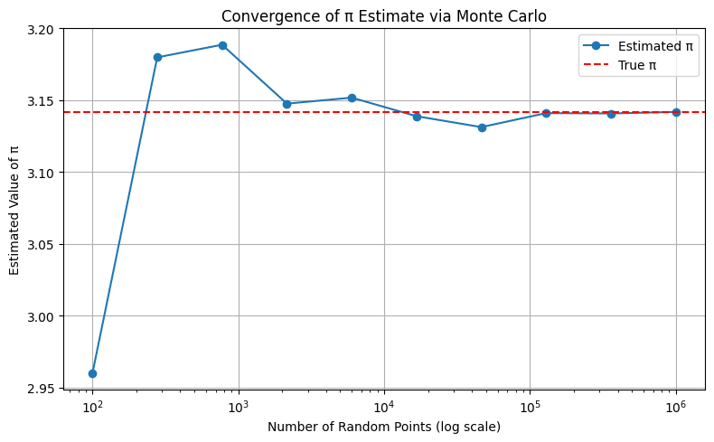
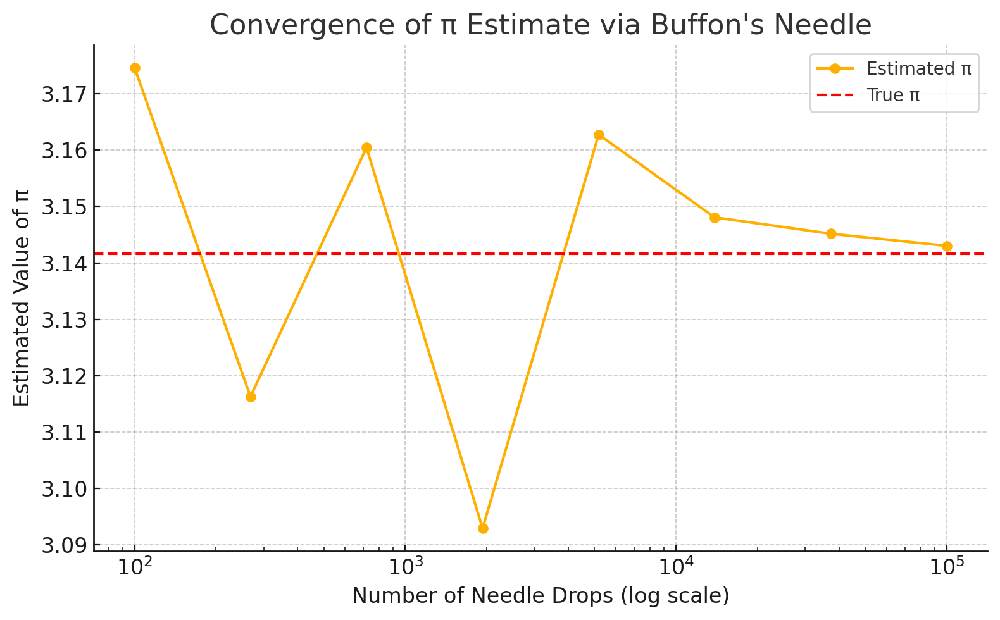

# Problem 2

# 📐 Estimating π Using Monte Carlo Methods

##  Motivation

Monte Carlo methods are widely used in physics, engineering, and finance to simulate random processes. One of the most intuitive and visually appealing applications of this method is estimating the value of π — the ratio of a circle’s circumference to its diameter.

In this project, we implement and compare **two classic methods** for estimating π:
1. The **geometric circle method** (area-based approach).
2. The **Buffon's needle experiment** (probabilistic geometry).

These methods reveal the power of randomness and how it can be used to derive accurate approximations for fundamental constants.

---

##  Part 1: Estimating π with Random Points in a Circle

### 1. Theoretical Background

We place a unit circle (radius = 1) inside a square of side 2 (from -1 to 1 in both axes). Random points $(x, y)$ are generated within the square. If a point lies within the circle, it satisfies:

$$
x^2 + y^2 \leq 1
$$

Since the area of the square is $4$ and the area of the unit circle is $\pi$, the ratio of points falling inside the circle approximates the ratio of the areas:

$$
\frac{\text{Points inside}}{\text{Total points}} \approx \frac{\pi}{4}
\quad \Rightarrow \quad \pi \approx 4 \cdot \frac{\text{Inside}}{\text{Total}}
$$

This provides a simple way to estimate π using only geometry and random numbers.

---

### 2. Simulation Process

We simulate $n$ random points within the square, count how many fall within the circle, and apply the formula above to estimate π.

 Python code to simulate $n$ random points, count how many fall within the unit circle, and estimate π:

```python

import numpy as np

def monte_carlo_pi(n_points=10000):
    x = np.random.uniform(-1, 1, n_points)
    y = np.random.uniform(-1, 1, n_points)
    inside = x**2 + y**2 <= 1
    pi_estimate = 4 * np.sum(inside) / n_points
    print(f"Estimated π ≈ {pi_estimate:.5f} using {n_points} random points")

    return pi_estimate

# Example use:
monte_carlo_pi(10000)


```

---

### 3. Visualization of Points

To better understand the process, we visualize:
- **Green points** that fall **inside** the circle.
- **Red points** that fall **outside** the circle.



This helps illustrate how the method works geometrically and intuitively.

---

### 4. Accuracy and Convergence

The law of large numbers tells us that the estimate will converge to the true value of π as the number of points increases.



We observe:
- With a small number of points (e.g. 100), the estimate is unstable.
- With 10,000+ points, the estimate approaches 3.14 and stabilizes.

---

##  Part 2: Estimating π Using Buffon’s Needle

### 1. Theoretical Background

**Buffon's Needle** is a classical problem in probability. Imagine a floor with parallel lines spaced distance $d$ apart. A needle of length $L \leq d$ is dropped randomly. The probability that the needle crosses a line is given by:

$$
P = \frac{2L}{\pi d}
\quad \Rightarrow \quad \pi \approx \frac{2L \cdot N}{d \cdot H}
$$

Where:
- $N$ = total needle drops
- $H$ = number of crossings (hits)
- $L$ = needle length
- $d$ = line spacing

This method connects geometry, probability, and estimation in a surprising and elegant way.

---

### 2. Simulation Process

We simulate random needle drops:
- Randomize the needle center's position between two lines
- Randomize the angle
- Check if the needle crosses a line

```python

import numpy as np

def buffon_needle_simulation(n_needles=10000, L=1.0, d=1.0):
    """
    Simulates Buffon's Needle experiment.
    
    Parameters:
        n_needles (int): Number of needle drops.
        L (float): Length of the needle.
        d (float): Distance between parallel lines (must be >= L for the formula to hold).

    Returns:
        Estimated value of π.
    """
    if L > d:
        raise ValueError("Needle length must be less than or equal to the distance between lines.")
        
    hits = 0
    for _ in range(n_needles):
        x = np.random.uniform(0, d / 2)  # Distance from center to nearest line
        theta = np.random.uniform(0, np.pi / 2)  # Angle with respect to the lines
        if x <= (L / 2) * np.sin(theta):
            hits += 1

    if hits == 0:
        return float('inf')  # Avoid division by zero

    pi_estimate = (2 * L * n_needles) / (d * hits)
    print(f"Estimated π ≈ {pi_estimate:.5f} from {n_needles} needle drops")
    return pi_estimate

# Example usage:
buffon_needle_simulation(n_needles=10000)


```

---

### 3. Visualization of Needle Drops

To illustrate:
- **Blue needles** cross a line.
- **Gray needles** do not cross.

Parallel lines are shown as vertical dashed lines.

📌 **Insert Here: Plot showing needle drops and line crossings. Title includes total drops, hits, and estimated π.**

This makes the geometric probability visible and understandable.

---

### 4. Convergence and Comparison

As the number of needle drops increases, the estimate of π improves, although more slowly than with the circle method.



# [Colablink](https://colab.research.google.com/drive/1PVaJJGIUGTa7_HKSwAy3jXSBmQhhJ7_r?usp=sharing)

We compare:
- Convergence rate
- Variance in estimates
- Sensitivity to sample size

---

## 📊 Summary Table

| Method            | Estimate Formula                                   | Speed of Convergence | Accuracy (n=10,000) | Notes                           |
|-------------------|----------------------------------------------------|----------------------|---------------------|---------------------------------|
| Circle Method      | $π ≈ 4 \cdot \frac{M}{N}$                         | Faster               | ±0.01–0.03          | Simple, visual, low variance    |
| Buffon's Needle    | $π ≈ \frac{2L \cdot N}{d \cdot H}$                | Slower               | ±0.05–0.1           | Historical, higher variability  |

Where:
- $M$ = number of points inside the circle
- $N$ = total number of points
- $H$ = number of hits (needle crosses a line)

---

## ✅ Conclusion

This project demonstrates the power and versatility of Monte Carlo methods:

- The **Circle Method** provides a fast and visual estimation of π with good accuracy and simple implementation.
- **Buffon’s Needle** offers a beautiful probabilistic approach rooted in classical mathematics but converges more slowly and shows more variation.

Both highlight how randomness, geometry, and probability come together in computational simulations. These experiments build a deeper understanding of convergence, estimation, and the connection between mathematics and real-world simulation.

---
