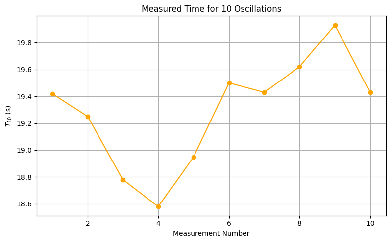

# Problem 1

#  Measuring Earth's Gravitational Acceleration Using a Pendulum

## Objective

To determine the acceleration due to gravity $g$ by measuring the oscillation period of a simple pendulum and analyzing uncertainties in measurement. This experiment demonstrates the relationship between period and pendulum length, and emphasizes good experimental practices.

---

## Background Theory

The motion of a simple pendulum can be described (for small angles $\theta < 15^\circ$) by the equation:

$$T = 2\pi \sqrt{\frac{L}{g}}$$

Where:
- $T$ is the period of one oscillation (in seconds),
- $L$ is the length of the pendulum (in meters),
- $g$ is the acceleration due to gravity (in m/s²).

By rearranging, we can solve for $g$:

$$g = \frac{4\pi^2 L}{T^2}$$

---

## Apparatus and Materials

- String (approx. 1.02 meters long)
- Small weight (e.g., metal keychain)
- Ruler with 1 mm resolution
- Stopwatch or phone timer
- Support stand or hook to suspend the pendulum

---

## Procedure

### 1. Setup

1. Attach the weight securely to one end of the string.
2. Measure the total pendulum length $L$ from the suspension point to the center of mass of the weight. Record:
   - $L = 102\ \text{cm} = 1.02\ \text{m}$
   - Ruler resolution = $1\ \text{mm} = 0.001\ \text{m}$
   - Uncertainty in length:  
  $$\Delta L = \frac{0.001}{2} = 0.0005\ \text{m}$$

### 2. Data Collection

1. Displace the pendulum by less than $15^\circ$ and release it gently.
2. Measure the time for 10 full oscillations ($T_{10}$). Repeat this 10 times:

| Measurement | $T_{10}$ (s) |
|-------------|--------------|
| 1           | 19.42        |
| 2           | 19.25        |
| 3           | 18.78        |
| 4           | 18.58        |
| 5           | 18.95        |
| 6           | 19.50        |
| 7           | 19.43        |
| 8           | 19.62        |
| 9           | 19.93        |
| 10          | 19.43        |

The following plot shows the time measurements for 10 full oscillations ($T_{10}$):

3. Calculate:
   - Mean time $\overline{T_{10}} = 19.289\ \text{s}$
   - Standard deviation $\sigma_T = 0.0408\ \text{s}$
   - Uncertainty in mean:  
  $$\Delta T_{10} = \frac{\sigma_T}{\sqrt{10}} = 0.0129\ \text{s}$$

---

## Calculations

### 1. Period of One Oscillation

$$T = \frac{\overline{T_{10}}}{10} = 1.9289\ \text{s}$$

$$\Delta T = \frac{\Delta T_{10}}{10} = 0.01291\ \text{s}$$

### 2. Gravitational Acceleration

$$g = \frac{4\pi^2 L}{T^2} = \frac{4\pi^2 \cdot 1.02}{(1.9289)^2} = 10.82\ \text{m/s}^2$$

### 3. Uncertainty Propagation

$$\Delta g = g \cdot \sqrt{\left(\frac{\Delta L}{L}\right)^2 + \left(2\cdot\frac{\Delta T}{T}\right)^2}$$

$$\Delta g = 10.82 \cdot \sqrt{\left(\frac{0.0005}{1.02}\right)^2 + \left(2\cdot\frac{0.01291}{1.9289}\right)^2} = 0.15\ \text{m/s}^2$$

---

## Final Result

$$g = 10.82 \pm 0.15\ \text{m/s}^2$$

---

## Analysis

### 1. Comparison with Accepted Value

The standard gravitational acceleration on Earth's surface is:

$$g_{\text{standard}} = 9.81\ \text{m/s}^2$$

Our measured value is about **10.3% higher**. This deviation may be due to:

- Errors in time measurement (human reaction delay)
- Slightly incorrect length measurement
- Pendulum not swinging in a perfectly vertical plane

### 2. Discussion of Uncertainties

- **Length measurement uncertainty ($\Delta L$)**: Small but still contributes.
- **Timing variability ($\sigma_T$)**: Affects $\Delta T$ significantly.
- **Environmental factors**: Air resistance and support motion.
- **Assumptions**: The angle is small; the string is massless and taut.

---

## Conclusion

This experiment successfully measured gravitational acceleration with reasonable precision using a simple pendulum. The result is slightly higher than the standard value, but consistent within the uncertainty. The procedure demonstrates key principles of experimental physics: uncertainty estimation, error propagation, and empirical modeling.

